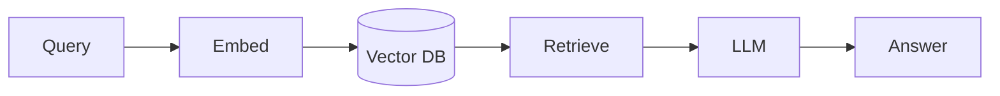

# Contributing to Bee 🐝

**Welcome to the hive!** Bee exists because people like you share what they know. Whether you're
fixing a typo, adding a diagram, correcting a code sample, or writing a whole new tutorial —
you belong here, and this guide will get you contributing in minutes.

> [!NOTE]
> **You do not need to be an expert.** Some of the most valuable contributions come from
> learners who just noticed something confusing. If it tripped you up, it's tripping up others.

## 📋 Table of Contents

- [Ways to Contribute](#ways-to-contribute)
- [Quick Start (5 minutes)](#quick-start-5-minutes)
- [The Content Contract](#the-content-contract)
- [Style Guide](#style-guide)
- [Contributing Code Examples](#contributing-code-examples)
- [Local Setup & Checks](#local-setup--checks)
- [Pull Request Process](#pull-request-process)
- [Difficulty Tiers](#difficulty-tiers)
- [Recognition](#recognition)

## Ways to Contribute

| Contribution | Effort | Where to start |
|---|---|---|
| 🐛 Fix a typo, broken link, or wrong fact | Tiny | Edit the file, open a PR |
| 🎨 Add or improve a Mermaid diagram | Small | Any concept page |
| 💡 Add a "Common Mistake" or "Best Practice" | Small | Any section |
| 📝 Write a new concept article | Medium | Copy a section's `_TEMPLATE` |
| 🏃 Add a runnable example | Medium–Large | [`examples/_TEMPLATE/`](examples/_TEMPLATE/) |
| 🗺️ Design a new learning path | Medium | [`docs/learning-paths/`](docs/learning-paths/) |
| 🌍 Translate content | Large | Open an issue to coordinate |

Look for issues labeled [`good first issue`](GOOD_FIRST_ISSUES.md) and `help wanted`, or search
the repo for `[WANTED]` markers in section READMEs — those are topics we'd love someone to write.

## Quick Start (5 minutes)

```bash
# 1. Fork the repo on GitHub, then clone your fork
git clone https://github.com/<your-username>/bee.git
cd bee

# 2. Create a branch (use a descriptive name)
git checkout -b docs/add-reranking-diagram

# 3. Make your change (edit Markdown, add a diagram, etc.)

# 4. Preview the docs site locally (optional but recommended)
pip install -r docs/requirements.txt
mkdocs serve                      # http://127.0.0.1:8000

# 5. Commit, push, and open a Pull Request
git commit -m "docs(rag): add reranking flow diagram"
git push origin docs/add-reranking-diagram
```

That's it. Our CI will check formatting, spelling, and links automatically.

## The Content Contract

To keep Bee consistent, **every concept/topic page follows the same skeleton.** When you add a
new page, copy the structure below (or the section's `_TEMPLATE.md`):

```markdown
---
tags: [Beginner]   # or Intermediate / Advanced
---

# Title

> One-sentence summary of what this page teaches.

## Overview
## Learning Objectives      <!-- 3–5 bullet "you will be able to…" -->
## Theory                   <!-- explain from first principles -->
## Diagram                  <!-- Mermaid, where it aids understanding -->
## Practical Example        <!-- runnable code -->
## Best Practices           <!-- ✅ do this -->
## Common Mistakes          <!-- ❌ avoid this -->
## Exercises                <!-- reinforce learning -->
## References               <!-- authoritative sources -->
```

Not every page needs every section — but the **order** should be consistent, and every page
must have **Overview**, **Learning Objectives**, and **References**.

## Style Guide

**Voice.** Write like you're explaining to a smart colleague who's new to the topic. Second
person ("you"), active voice, short paragraphs.

**Explain before you name.** Introduce the idea, *then* the jargon. "A number that represents
meaning (an **embedding**)" — not "an embedding is…".

**Show, then tell.** Prefer a concrete example or diagram over an abstract definition.

**Callouts** (they render as colored boxes on the site):

```markdown
> [!NOTE]      background info
> [!TIP]       a helpful shortcut
> [!IMPORTANT] don't-miss information
> [!WARNING]   a common footgun
> [!CAUTION]   something that can cause real harm (cost, security, data loss)
```

**Diagrams.** Use [Mermaid](https://mermaid.js.org/) — it renders on GitHub *and* the site:

````markdown

````

**Links.** Use relative links between docs (`../rag/chunking.md`) so they work on GitHub and the
site. External links should point to primary/authoritative sources.

**Spelling.** CI runs [cspell](https://cspell.org/). If it flags a legitimate technical term,
add it to [`.cspell-dict.txt`](.cspell-dict.txt) in your PR.

## Contributing Code Examples

Every runnable example is **self-contained** and lives in its own folder. Copy
[`examples/_TEMPLATE/`](examples/_TEMPLATE/) and follow its README. The contract:

- ✅ `README.md` — what it does, how to run it, what you'll learn
- ✅ `pyproject.toml` — pinned dependencies (we use [uv](https://docs.astral.sh/uv/), pip also works)
- ✅ `.env.example` — every required variable, with comments (never commit real keys)
- ✅ Runnable entrypoint (`python -m app` or `python main.py`)
- ✅ At least one test (so CI can catch breakage)
- ✅ Handles missing API keys gracefully (clear error, not a stack trace)

**Golden rule: if it doesn't run, it doesn't merge.** No pseudo-code presented as real code.

## Local Setup & Checks

Run the same checks CI runs, before you push:

```bash
# Docs preview
mkdocs serve

# Formatting (Markdown, YAML, JSON) — requires Node
npx prettier --check .

# Markdown linting
npx markdownlint-cli2 "**/*.md"

# Spell check
npx cspell "**/*.md"

# For code examples: from inside the example folder
uv run pytest
```

> [!TIP]
> Don't have Node or Python set up? Open the PR anyway — CI will tell you what to fix, and a
> maintainer can help.

## Pull Request Process

1. **One focused change per PR.** Easier to review, faster to merge.
2. **Use a [Conventional Commit](https://www.conventionalcommits.org/) title**, e.g.
   `docs(agents): add reflection pattern` or `fix(examples): pin anthropic version`.
   Valid types: `docs`, `feat`, `fix`, `chore`, `refactor`, `test`, `ci`.
3. **Fill in the PR template** — it takes 30 seconds and speeds up review.
4. **CI must pass** (format, lint, spelling, links, and example tests if you touched code).
5. A maintainer reviews within a few days. We aim for kind, specific, actionable feedback.

## Difficulty Tiers

Tag content honestly so readers land in the right place:

| Tier | Tag | Assumes |
|------|-----|---------|
| 🟢 Beginner | `tags: [Beginner]` | General programming; no ML background |
| 🟡 Intermediate | `tags: [Intermediate]` | You've built basic LLM features |
| 🔴 Advanced | `tags: [Advanced]` | Production experience |

## Recognition

Every contributor is credited. We use the
[All Contributors](https://allcontributors.org/) specification — documentation, code, design,
ideas, and review all count. Your first merged PR earns you a spot in the hive. 🐝

---

**Questions?** Open a [Discussion](https://github.com/bee-ai-labs/bee/discussions) or read
[SUPPORT.md](SUPPORT.md). Thank you for making Bee better for everyone.
