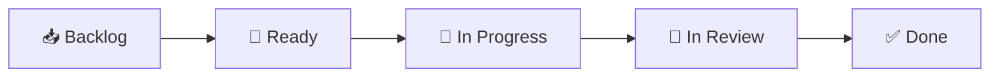

# Project Board 📋

Bee's work is tracked on a public GitHub Project board so anyone can see what's happening, what's
next, and where they can jump in.

➡️ **[Open the Bee Project Board](https://github.com/orgs/bee-ai-labs/projects/1)**

## How the board is organized

We use a simple Kanban flow. Every issue and PR moves left to right:

| Column | Meaning |
|--------|---------|
| 📥 **Backlog** | Ideas and requests, not yet scoped. Triaged regularly. |
| 🔖 **Ready** | Scoped and ready to be picked up. Look here for work! |
| 🚧 **In Progress** | Someone is actively working on it (assigned). |
| 👀 **In Review** | PR open, awaiting review or changes. |
| ✅ **Done** | Merged and shipped. |

## Views

The board offers several saved views:

- **By Milestone** — grouped by [Roadmap](ROADMAP.md) milestone (M1, M2, …).
- **By Section** — grouped by area (Concepts, RAG, Agents, Examples, …).
- **Good First Issues** — filtered to beginner-friendly work.
- **Needs Review** — PRs waiting on a reviewer.

## Labels that drive the board

| Label | Meaning |
|-------|---------|
| `good first issue` | Beginner-friendly, well-scoped |
| `help wanted` | Community contribution welcome |
| `content` | New or improved documentation |
| `example` | Runnable example code |
| `bug` | Something is wrong (broken link, error, wrong fact) |
| `proposal` | Significant change under discussion |
| `enhancement` | Improvement to existing content/tooling |
| `priority:high` | Bump to the top of Ready |

## How to get an issue onto the board

1. [Open an issue](https://github.com/bee-ai-labs/bee/issues/new/choose) using a template.
2. Maintainers triage it into **Backlog**, then scope it into **Ready**.
3. Comment to claim it → it moves to **In Progress** and gets assigned to you.

> [!NOTE]
> No board access needed to contribute. Just open issues and PRs — maintainers keep the board in
> sync. The board is a *map*, not a gate.

---

*See also: [ROADMAP.md](ROADMAP.md) for the big picture and
[GOOD_FIRST_ISSUES.md](GOOD_FIRST_ISSUES.md) to get started.* 🐝
