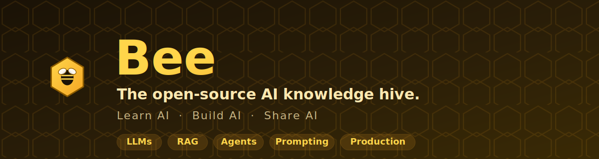

<!-- markdownlint-disable MD033 MD041 -->
<div align="center">



<h1>🐝 Bee</h1>

<h3>The open-source AI knowledge hive.</h3>
<p><em>Learn AI. Build AI. Share AI.</em></p>

<p>
  A community-driven collection of modern AI engineering resources — theory, runnable examples,
  production patterns, and learning paths. Think <strong>MDN for AI Engineering</strong>:
  freeCodeCamp + Awesome-AI + the OpenAI Cookbook, in one repository.
</p>

<p>
  <a href="#-quick-start"></a>
  <a href="docs/learning-paths/index.md"></a>
  <a href="CONTRIBUTING.md"></a>
</p>

<p>
  <a href="LICENSE"></a>
  <a href="LICENSE"></a>
  
  <a href="CODE_OF_CONDUCT.md"></a>
  
</p>

</div>

---

> [!NOTE]
> **Bee is not an AI application.** It is a *knowledge base* — a curated, beautifully
> organized library of everything a developer needs to learn and build with AI. Every page
> is finished and useful. No placeholders, no "coming soon."

## 📖 Table of Contents

- [Why Bee?](#-why-bee)
- [What's Inside](#-whats-inside)
- [Quick Start](#-quick-start)
- [Repository Structure](#-repository-structure)
- [Learning Paths](#-learning-paths)
- [Featured Examples](#-featured-examples)
- [How Content Is Organized](#-how-content-is-organized)
- [Contributing](#-contributing)
- [Roadmap](#-roadmap)
- [Community & Support](#-community--support)
- [FAQ](#-faq)
- [License](#-license)
- [Acknowledgements](#-acknowledgements)

## 🍯 Why Bee?

AI engineering knowledge is scattered across blog posts that rot, framework docs that assume
you already know the concepts, and tutorials that don't run. **Bee gathers the good stuff in
one place and holds it to a single quality bar:**

- 🧠 **Concepts explained from first principles** — you'll understand *why*, not just *how*.
- 🏃 **Every code example runs** — each lives in its own folder with dependencies and a README.
- 🗺️ **Structured learning paths** — go from "never called an LLM" to "shipping agents."
- 🏭 **Production patterns, not toys** — evaluation, security, cost, observability, deployment.
- 🎨 **Diagrams everywhere** — Mermaid diagrams make architectures click.
- 🌍 **Community-owned** — designed for hundreds of contributors from day one.

## 🧰 What's Inside

<table>
<tr>
<td width="33%" valign="top">

**🧠 Foundations**
- How LLMs work
- Transformers & attention
- Tokenization
- Embeddings
- Context windows

</td>
<td width="33%" valign="top">

**✍️ Building Blocks**
- Prompt engineering
- System prompts
- Structured outputs / JSON mode
- Function & tool calling
- Streaming

</td>
<td width="33%" valign="top">

**🔎 Retrieval (RAG)**
- Chunking strategies
- Vector databases
- Hybrid search
- Reranking
- RAG evaluation

</td>
</tr>
<tr>
<td width="33%" valign="top">

**🤖 Agents**
- Agent fundamentals
- Planning & reflection
- Memory
- Multi-agent systems
- MCP · LangGraph · CrewAI

</td>
<td width="33%" valign="top">

**🖼️ Multimodal**
- Vision models & OCR
- Speech recognition
- Text-to-speech
- Image generation

</td>
<td width="33%" valign="top">

**🏭 Production**
- Evaluation & guardrails
- Security & safety
- Deployment (Docker/K8s)
- Observability
- Inference optimization

</td>
</tr>
</table>

## 🚀 Quick Start

Bee is a reading-and-doing repository. There are three ways to use it:

**1. Browse on GitHub** — every folder has a `README.md`. Start with [`docs/`](docs/index.md).

**2. Read it as a website** (nicer search, dark mode, diagrams):

```bash
git clone https://github.com/bee-ai-labs/bee.git
cd bee
pip install -r docs/requirements.txt
mkdocs serve          # open http://127.0.0.1:8000
```

**3. Run an example** — each example is self-contained:

```bash
cd examples/01-chatbot
cp .env.example .env          # add your API key
uv sync                       # or: pip install -e .
python -m app                 # run it
```

> [!TIP]
> New to AI engineering? Don't read randomly — follow a
> [**Learning Path**](docs/learning-paths/index.md). It sequences the content so each concept
> builds on the last.

## 🗂️ Repository Structure

```text
bee/
├── docs/               📚 The knowledge base (also the MkDocs website)
│   ├── concepts/          🟢 Foundations: LLMs, transformers, tokenization, embeddings
│   ├── prompting/         🟡 Prompting, system prompts, structured output, tool calling
│   ├── rag/               🟡 Chunking, vector DBs, hybrid search, reranking, eval
│   ├── agents/            🔴 Single/multi-agent, planning, memory, MCP, LangGraph, CrewAI
│   ├── vision/ speech/    🖼️ Multimodal: vision, OCR, speech-to-text, TTS
│   ├── evaluation/        📏 Evals, benchmarks, hallucination, guardrails
│   ├── security/          🛡️ Prompt injection, safety, auth, rate limiting
│   ├── deployment/        🚢 Docker, Kubernetes, serving, scaling
│   ├── mlops/             ⚙️ CI/CD, observability, monitoring, cost
│   └── learning-paths/    🗺️ Curated sequences for each skill level
├── examples/           🏃 Self-contained, runnable Python projects
├── architectures/      🏗️ Reference architectures + decision records (Mermaid)
├── templates/          📦 Copy-paste starters (FastAPI+LLM, RAG service, agent loop)
├── guides/             🧭 Task-oriented how-tos ("how do I stream responses?")
├── tutorials/          📝 End-to-end walkthroughs (build X from scratch)
├── datasets/ benchmarks/  📊 Curated data pointers + evaluation harnesses
├── assets/             🎨 Banner, logo, brand guide, diagram sources
├── scripts/            🛠️ Repo tooling (new-example scaffolder, link checks)
└── .github/            🤖 Issue/PR templates, CI workflows, automation
```

## 🗺️ Learning Paths

Instead of a pile of articles, Bee sequences content into paths. Pick where you are:

| Path | For | Starts with |
|------|-----|-------------|
| 🟢 **AI Engineer — Fundamentals** | You can code, but LLMs are new | [How LLMs Work](docs/concepts/how-llms-work.md) |
| 🟡 **Building with LLMs** | You've made API calls, want to build real features | [Prompt Engineering](docs/prompting/prompt-engineering.md) |
| 🟡 **RAG Specialist** | You need models to use *your* data | [RAG Overview](docs/rag/index.md) |
| 🔴 **Agent Engineer** | You're building autonomous, tool-using systems | [Agent Fundamentals](docs/agents/fundamentals.md) |
| 🔴 **Production & MLOps** | You need to ship, monitor, and scale | [Deployment](docs/deployment/index.md) |

➡️ **[See all learning paths →](docs/learning-paths/index.md)**

## ⭐ Featured Examples

Every example is a complete, runnable project with its own README, dependencies, and tests.

| Example | What it teaches | Level |
|---------|-----------------|-------|
| [`01-chatbot`](examples/01-chatbot/) | Streaming chat, conversation state, cost tracking | 🟢 |
| [`02-rag-document-qa`](examples/02-rag-document-qa/) | Chunking, embeddings, retrieval, cited answers | 🟡 |
| [`03-research-agent`](examples/03-research-agent/) | Tool use, planning, multi-step reasoning | 🔴 |

➡️ **[Browse all examples →](examples/)**

## 🎯 How Content Is Organized

Every section of the knowledge base follows the **same structure**, so you always know what
to expect:

> **Overview** → **Learning Objectives** → **Theory** → **Practical Examples** →
> **Code Snippets** → **Diagrams** → **Best Practices** → **Common Mistakes** →
> **Exercises** → **References**

Content is tagged by difficulty so you can meet yourself where you are:

- 🟢 **Beginner** — assumes general programming knowledge only
- 🟡 **Intermediate** — assumes you've built basic LLM features
- 🔴 **Advanced** — assumes production experience

## 🤝 Contributing

**Bee is built by its community — and that means you.** Whether you fix a typo, add a diagram,
or write an entire tutorial, you're welcome here.

1. Read the [**Contributing Guide**](CONTRIBUTING.md) (5-minute read).
2. Find a [**good first issue**](GOOD_FIRST_ISSUES.md) or a `[WANTED]` topic in any section README.
3. Copy the relevant `_TEMPLATE/` and fill it in.
4. Open a PR — our CI checks formatting, spelling, and links so you don't have to.

By participating you agree to our [Code of Conduct](CODE_OF_CONDUCT.md).

## 📍 Roadmap

Bee grows in public. See the full [**Roadmap**](ROADMAP.md) and
[**Changelog**](CHANGELOG.md).

- [x] **M0** — Foundation: structure, docs site, community & CI
- [ ] **M1** — Flagship knowledge: Concepts, Prompting, RAG, Agents (deep)
- [ ] **M2** — Runnable example fleet
- [ ] **M3** — Breadth: vision, speech, eval, security, deployment
- [ ] **M4** — Interactive notebooks & video companions

## 💬 Community & Support

- 💡 **Questions & ideas** → [GitHub Discussions](https://github.com/bee-ai-labs/bee/discussions)
- 🐛 **Bugs & content errors** → [Open an issue](https://github.com/bee-ai-labs/bee/issues/new/choose)
- 🛟 **Need help?** → [SUPPORT.md](SUPPORT.md)
- 🔒 **Security concern?** → [SECURITY.md](SECURITY.md)

## ❓ FAQ

<details>
<summary><strong>Is Bee affiliated with any AI company?</strong></summary>

No. Bee is an independent, community-driven, open-source project. It uses vendor SDKs in
examples but the *concepts* are vendor-neutral.
</details>

<details>
<summary><strong>Which LLM provider do the examples use?</strong></summary>

Concepts are provider-agnostic. Code examples default to the Anthropic SDK for concreteness,
with notes on adapting to OpenAI, Google, Ollama, and others. You can run most examples against
any provider.
</details>

<details>
<summary><strong>Do I need a GPU?</strong></summary>

No. Almost everything uses hosted APIs. The few local-model sections clearly say so and offer
CPU-friendly alternatives.
</details>

<details>
<summary><strong>Can I use Bee content in my own course/blog/book?</strong></summary>

Yes — docs are CC-BY-4.0 (give credit) and code is MIT. See [LICENSE](LICENSE).
</details>

<details>
<summary><strong>How do I keep code examples from breaking as APIs change?</strong></summary>

Each example pins its dependencies and runs in CI. See [CONTRIBUTING.md](CONTRIBUTING.md) for
the maintenance policy.
</details>

## 📜 License

Bee is **dual-licensed**: documentation and prose under
[**CC-BY-4.0**](https://creativecommons.org/licenses/by/4.0/), and all source code under the
[**MIT License**](LICENSE). In short — reuse freely, just give credit. 🐝

## 🙏 Acknowledgements

Bee stands on the shoulders of the open-source AI community and is inspired by the clarity of
[MDN Web Docs](https://developer.mozilla.org/), the practicality of the
[OpenAI Cookbook](https://github.com/openai/openai-cookbook), the breadth of the
[Awesome](https://github.com/sindresorhus/awesome) lists, and the welcoming ethos of
[freeCodeCamp](https://www.freecodecamp.org/).

<div align="center">

**Built with 🍯 by the Bee community.**

If Bee helps you, consider giving it a ⭐ — it helps other developers find the hive.

</div>
