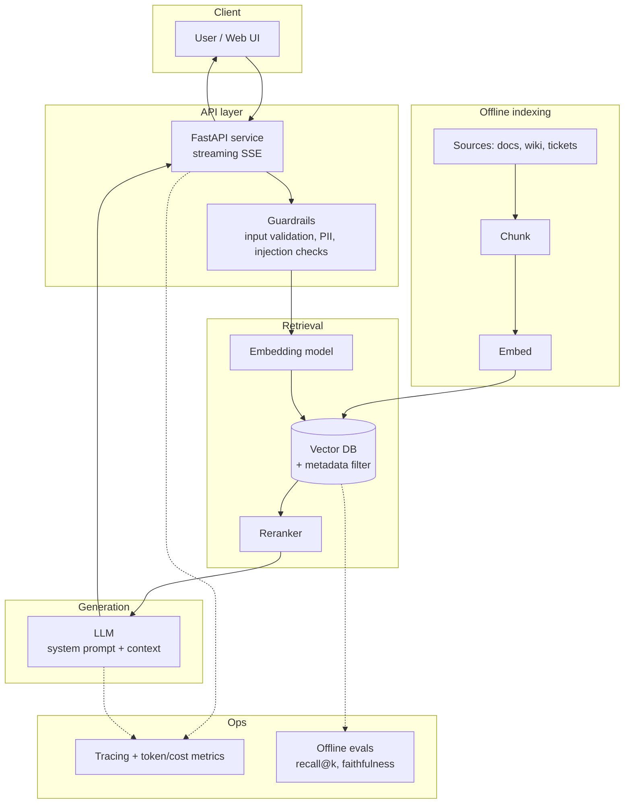

# Reference Architecture: RAG Chatbot

> A production-shaped architecture for a chatbot that answers from your documents, with citations,
> streaming, and guardrails.

**Use when:** users need to ask natural-language questions over a private, changing knowledge base
and get trustworthy, cited answers.

## Diagram

## Components

| Component | Responsibility | Bee reference |
|-----------|----------------|---------------|
| **Chunking** | Split sources into retrievable pieces | [Chunking](../docs/rag/chunking.md) |
| **Embedding model** | Turn text into vectors | [Embeddings](../docs/concepts/embeddings.md) |
| **Vector DB** | Store vectors, ANN search, metadata filtering | [Vector Databases](../docs/rag/vector-databases.md) |
| **Reranker** | Reorder candidates for precision | [Hybrid Search & Reranking](../docs/rag/hybrid-search-reranking.md) |
| **Guardrails** | Validate input/output; block injection & PII leaks | [Security](../docs/security/index.md) |
| **LLM + system prompt** | Generate grounded, cited answers | [System Prompts](../docs/prompting/system-prompts.md) |
| **Observability** | Trace requests; track latency, tokens, cost | [MLOps](../docs/mlops/index.md) |
| **Evaluation** | Measure retrieval & answer quality | [Evaluating RAG](../docs/rag/evaluation.md) |

## Key decisions & trade-offs

- **Metadata filtering is mandatory for multi-tenant data** — filter by tenant/user *during*
  retrieval so users can never retrieve others' documents. This is both a relevance and a
  [security](../docs/security/index.md) control.
- **Rerank only if evals justify it** — it adds latency and cost. Start without; add when
  recall@k needs it.
- **Stream responses** — RAG prompts are large and generations can be long; streaming keeps the
  UX responsive.
- **Cache embeddings and (where safe) responses** — cuts cost and latency materially.

## When *not* to use this

- The knowledge is small and static → just put it in the system prompt.
- You need actions, not just answers → add [tools/agents](../docs/agents/index.md).
- You need new model *behavior/skills* → consider fine-tuning instead of (or with) RAG.

## Implements / related

- Runnable starting point: [`examples/02-rag-document-qa`](../examples/02-rag-document-qa/)
- Learning path: [RAG Specialist](../docs/learning-paths/index.md)
