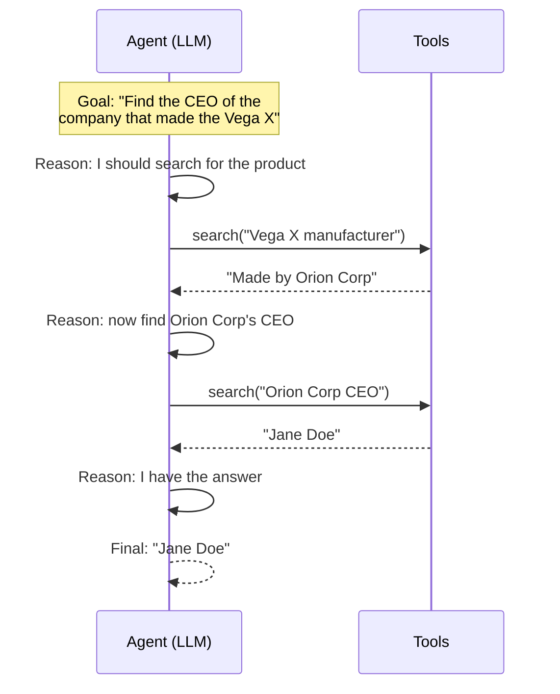
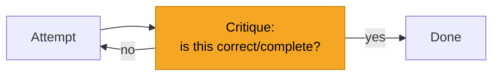

# Agent Fundamentals

> Build a working agent from scratch and understand its anatomy: the loop, planning, reflection,
> and the guardrails that keep it from running away.

## Overview

An agent is an LLM wrapped in a loop that lets it take multiple actions toward a goal. Under the
hood it's the [tool-calling loop](../prompting/function-calling.md) plus a few ideas — **planning**
(decide the approach), **reflection** (check and correct the work), and **stopping conditions**
(know when to quit). This page builds one you can run, then layers on those ideas.

## Learning Objectives

By the end of this page you will be able to:

- Implement the core agent loop.
- Add planning and reflection to improve reliability.
- Set stopping conditions and budgets to prevent runaway loops.
- Recognize and mitigate common agent failure modes.

## Theory

### The core loop (ReAct)

The dominant pattern is **ReAct** — *Reason + Act*. The model alternates between reasoning about
what to do and taking an action, observing each result before continuing.



Each cycle, the model sees the full history (its reasoning + tool results) and decides the next
action — until it decides it's done.

### Planning: think before acting

For complex goals, prompt the agent to **plan first** — outline the steps, then execute them.
Planning reduces flailing and makes behavior easier to debug.

```text
First, write a short numbered plan to accomplish the goal.
Then execute the plan step by step, using tools as needed.
Revise the plan if new information changes it.
```

### Reflection: check your own work

**Reflection** has the agent critique its output and try again if it's inadequate — catching
errors a single pass would miss.



Use it judiciously — reflection adds LLM calls (cost and latency). It shines on tasks where
correctness matters more than speed (code, analysis).

## Practical Example: a minimal agent

A compact but complete agent loop with tools, a step budget, and a stop condition:

```python title="agent.py"
import json
from anthropic import Anthropic

client = Anthropic()

# --- Tools (your real implementations) ---
def search(query: str) -> str:
    fake_web = {
        "Vega X manufacturer": "The Vega X is made by Orion Corp.",
        "Orion Corp CEO": "Orion Corp's CEO is Jane Doe.",
    }
    return fake_web.get(query, "No results.")

TOOL_IMPL = {"search": search}
TOOLS = [{
    "name": "search",
    "description": "Search the web for a short factual query.",
    "input_schema": {
        "type": "object",
        "properties": {"query": {"type": "string"}},
        "required": ["query"],
    },
}]

SYSTEM = (
    "You are a research agent. Plan briefly, then use the search tool step by step. "
    "When you have the answer, state it clearly without calling more tools."
)

def run_agent(goal: str, max_steps: int = 6) -> str:
    messages = [{"role": "user", "content": goal}]
    for step in range(max_steps):                         # <-- budget prevents runaway loops
        resp = client.messages.create(
            model="claude-sonnet-5", max_tokens=800,
            system=SYSTEM, tools=TOOLS, messages=messages,
        )
        messages.append({"role": "assistant", "content": resp.content})

        if resp.stop_reason != "tool_use":                # <-- stop condition: no more tools
            return "".join(b.text for b in resp.content if b.type == "text")

        results = []
        for block in resp.content:
            if block.type == "tool_use":
                try:
                    output = TOOL_IMPL[block.name](**block.input)
                except Exception as e:                    # <-- return errors so the agent adapts
                    output = f"ERROR: {e}"
                results.append({"type": "tool_result",
                                "tool_use_id": block.id, "content": output})
        messages.append({"role": "user", "content": results})

    return "Stopped: reached the step budget without finishing."

print(run_agent("Who is the CEO of the company that makes the Vega X?"))
```

Notice the three guardrails baked in: a **step budget** (`max_steps`), a clear **stop condition**
(`stop_reason != "tool_use"`), and **error handling** that feeds failures back so the agent can
recover instead of crashing.

## Agent failure modes (and fixes)

| Failure | Symptom | Fix |
|---------|---------|-----|
| **Looping** | Repeats the same action forever | Step budget; detect repeated actions |
| **Runaway cost** | Many expensive calls | Budget on steps *and* tokens |
| **Getting lost** | Drifts from the goal | Restate the goal; plan-and-revise |
| **Bad tool use** | Wrong tool / wrong args | Clearer tool descriptions; validate inputs |
| **Overconfidence** | Confidently wrong final answer | Add reflection; verify with a tool |
| **Unsafe actions** | Does something irreversible | [Human-in-the-loop](../security/index.md) for high-risk tools |

## Best Practices

- ✅ Always cap steps *and* token budget — no unbounded loops.
- ✅ Start with the fewest, clearest tools; add more only when needed.
- ✅ Return tool errors to the agent so it can adapt.
- ✅ Add planning for complex goals, reflection where correctness is critical.
- ✅ Require human confirmation for irreversible/high-impact actions.
- ✅ Log every step (reasoning, tool, result) for debugging and [evaluation](../evaluation/index.md).

## Common Mistakes

- ❌ No step/cost budget → infinite loops and surprise bills.
- ❌ Too many tools → the model picks the wrong one.
- ❌ Swallowing tool errors → the agent can't recover.
- ❌ Adding reflection everywhere → slow and expensive with little gain.
- ❌ Giving powerful tools without oversight → real-world damage from a wrong step.

## Exercises

1. Run the example, then add a `calculator` tool and a goal that needs both search and math.
   Watch the loop combine them.
2. Add a simple loop-detector: if the agent requests the identical tool call twice, intervene.
3. Add a reflection step before the final answer ("Is this fully supported by what you found?").
   Does answer quality improve? At what cost?

## References

- [ReAct paper](https://arxiv.org/abs/2210.03629) — Reasoning + Acting
- [Reflexion paper](https://arxiv.org/abs/2303.11366) — reflection for agents
- [Anthropic — Building effective agents](https://www.anthropic.com/research/building-effective-agents)
- Next in Bee: [Memory](memory.md) · [Multi-Agent Systems](multi-agent.md) · [MCP](mcp.md)
