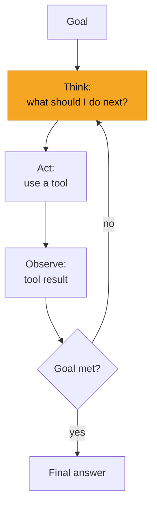

# AI Agents

> An agent is an LLM that decides *and acts* in a loop — choosing tools, taking steps, and
> reacting to results — instead of answering once. This section shows how to build them well, and
> when not to.

## Overview

Most LLM features are a single request and response. An **agent** is different: given a goal, it
reasons about what to do, uses [tools](../prompting/function-calling.md) to act, observes the
results, and repeats until the goal is met. This unlocks tasks that need multiple steps, external
data, and adaptation — research, coding, workflow automation — but it also introduces new failure
modes, cost, and risk. Building agents well is as much about *constraints* as capabilities.

## Learning Objectives

By the end of this section you will be able to:

- Define what an agent is and recognize when one is (and isn't) the right tool.
- Build a basic agent loop with planning and reflection.
- Give an agent [memory](memory.md) that persists across steps and sessions.
- Design [multi-agent](multi-agent.md) systems and know their trade-offs.
- Connect agents to tools and data with [MCP](mcp.md).

## What is an agent, really?

That **Think → Act → Observe** loop is the essence of every agent. It's the
[tool-calling loop](../prompting/function-calling.md) you already met, given autonomy over *how
many* steps to take and *which* tools to use.

## What you'll learn

- :material-robot:{ .lg .middle } **[Agent Fundamentals](fundamentals.md)**

    ---

    The loop, planning, and reflection — build a working agent and understand its anatomy.

- :material-memory:{ .lg .middle } **[Memory](memory.md)**

    ---

    Short-term, long-term, and semantic memory so agents remember within and across sessions.

- :material-account-group:{ .lg .middle } **[Multi-Agent Systems](multi-agent.md)**

    ---

    Orchestrator–worker and other patterns — and when multiple agents help vs. hurt.

- :material-connection:{ .lg .middle } **[Model Context Protocol (MCP)](mcp.md)**

    ---

    An open standard for connecting agents to tools and data through one interface.

## When to build an agent

> [!IMPORTANT]
> **Prefer the simplest thing that works.** Agents are powerful but harder to make reliable,
> more expensive, and riskier. Reach for a plain prompt, [structured output](../prompting/structured-outputs.md),
> or a fixed [tool-calling](../prompting/function-calling.md) workflow first.

| An agent fits when… | Avoid an agent when… |
|---|---|
| The steps aren't known in advance | A fixed sequence always works → hard-code it |
| The task needs to adapt to intermediate results | The task is one call → just prompt |
| Multiple tools must be combined dynamically | Latency/cost/determinism are critical |

## Frameworks

You can build agents from scratch (recommended for learning — see
[Fundamentals](fundamentals.md)) or use a framework: **LangGraph** (graph-based, controllable),
**CrewAI** (role-based multi-agent), and others. Bee teaches the *principles* first so any
framework makes sense; framework-specific guides are marked `[WANTED]` for contributors.

## Prerequisites

Read [Function & Tool Calling](../prompting/function-calling.md) first — the agent loop is built
directly on it.
