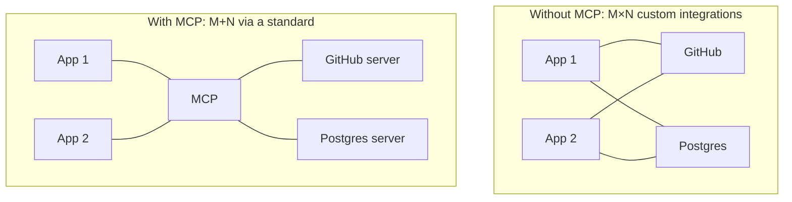
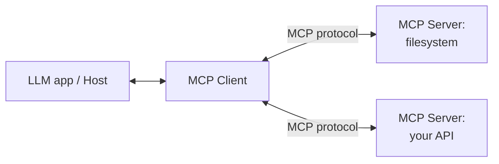

# Model Context Protocol (MCP)

> MCP is an open standard for connecting AI applications to tools and data through one common
> interface — "USB-C for AI." Build a capability once as an MCP server, and any MCP-compatible
> app can use it.

## Overview

Before MCP, every AI app integrated every tool and data source in its own bespoke way — an
_M×N_ integration problem. The **Model Context Protocol** (introduced by Anthropic in late 2024
and now broadly adopted) standardizes that interface. You write an **MCP server** that exposes
tools, data, and prompts; any **MCP client** (Claude Desktop, IDEs, your own agent) can connect
to it. _M×N_ integrations become _M+N_.

## Learning Objectives

By the end of this page you will be able to:

- Explain what problem MCP solves and its client–server architecture.
- Describe the three things an MCP server can expose: tools, resources, and prompts.
- Build a minimal MCP server.
- Decide when MCP is the right choice over plain [tool calling](../prompting/function-calling.md).

## Theory

### The M×N problem MCP solves



Write a Postgres MCP server once, and every MCP-compatible app can query Postgres — no custom
glue per app.

### Architecture: clients and servers

- **Host / Client** — the AI application (Claude Desktop, an IDE, your agent). It connects to
  servers and makes their capabilities available to the model.
- **Server** — a program that exposes capabilities over the protocol. Runs locally (via stdio) or
  remotely (via HTTP).



### What a server exposes

| Primitive | What it is | Example |
|-----------|-----------|---------|
| **Tools** | Functions the model can call (actions) | `create_issue`, `run_query` |
| **Resources** | Data the app can read (context) | Files, database rows, docs |
| **Prompts** | Reusable prompt templates | "Summarize this PR" |

Tools map directly onto the [tool-calling](../prompting/function-calling.md) you already know —
MCP just standardizes how they're described and invoked, so they're portable across apps.

## Practical Example: a minimal MCP server

Using the official Python SDK (`pip install mcp`), here's a server exposing one tool and one
resource:

```python title="weather_server.py"
from mcp.server.fastmcp import FastMCP

mcp = FastMCP("weather")

@mcp.tool()
def get_forecast(city: str) -> str:
    """Get a short weather forecast for a city."""
    # Real implementation would call a weather API.
    return f"{city}: 24°C, sunny with light wind."

@mcp.resource("weather://cities")
def supported_cities() -> str:
    """List cities this server supports."""
    return "Kigali, Nairobi, Kampala, Dar es Salaam"

if __name__ == "__main__":
    mcp.run()          # serves over stdio by default
```

Register it with an MCP client (e.g. Claude Desktop's config) and the model can now call
`get_forecast` and read the `weather://cities` resource — without you writing any app-specific
integration code.

```json title="claude_desktop_config.json (excerpt)"
{
  "mcpServers": {
    "weather": { "command": "python", "args": ["weather_server.py"] }
  }
}
```

!!! tip "Reuse the ecosystem"
    Before building a server, check for an existing one — there are open-source MCP servers for
    filesystems, GitHub, Slack, Postgres, and many more. Often you just configure, not code.

## MCP vs. plain tool calling

| | **Plain tool calling** | **MCP** |
|---|---|---|
| Scope | Tools defined *inside* your app | Tools in reusable, external servers |
| Reuse | Per-app | Across any MCP client |
| Best for | App-specific logic, quick start | Shared capabilities, ecosystems, standardization |

They're complementary: MCP servers ultimately expose *tools*, and the model uses them via the
same loop. Start with plain tool calling; adopt MCP when you want portability or to plug into the
growing ecosystem.

## Security

> [!CAUTION]
> An MCP server can grant an agent real power (files, databases, APIs). Only connect **trusted**
> servers, run them with **least privilege**, and apply the same
> [safety practices](../security/index.md) as any tool — validate inputs and gate destructive
> actions behind human confirmation. A malicious or compromised server is a serious risk.

## Best Practices

- ✅ Prefer existing, trusted servers over reinventing integrations.
- ✅ Keep each server focused; expose the minimum tools/resources needed.
- ✅ Write clear tool descriptions — they guide the model's usage.
- ✅ Run servers with least-privilege credentials; audit what they can do.
- ✅ Version and document your servers so clients can rely on them.

## Common Mistakes

- ❌ Connecting untrusted servers — a real security hole.
- ❌ Over-broad servers exposing far more capability than needed.
- ❌ Reaching for MCP when in-app tool calling would be simpler.
- ❌ Skipping input validation because "it's just an MCP tool."

## Exercises

1. Build and run the weather server; connect it to an MCP-compatible client and call the tool.
2. Add a second tool with input validation (e.g. reject unknown cities) and return a clean error.
3. Find an open-source MCP server (filesystem or GitHub), configure it, and use it from a client.

## References

- [Model Context Protocol — official docs](https://modelcontextprotocol.io/)
- [MCP Python SDK](https://github.com/modelcontextprotocol/python-sdk)
- [Anthropic — Introducing MCP](https://www.anthropic.com/news/model-context-protocol)
- Bee: [Function & Tool Calling](../prompting/function-calling.md) · [Security](../security/index.md)
