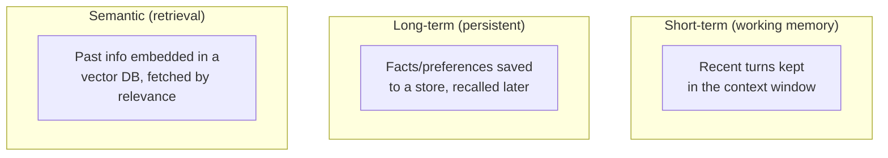
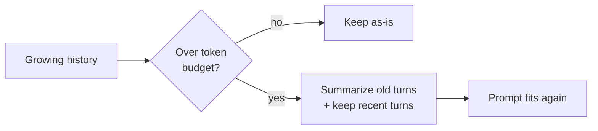

# Agent Memory

> LLMs are stateless — they forget everything between calls. Memory is how you give an agent
> continuity: within a task, across a conversation, and across sessions.

## Overview

Each LLM call only "knows" what's in its [context window](../concepts/tokenization.md). Once
tokens fall out of the window — or the session ends — that information is gone. **Memory** is the
engineering around a stateless model that creates the *illusion* (and utility) of persistence:
keeping recent turns, summarizing old ones, and storing facts to recall later.

## Learning Objectives

By the end of this page you will be able to:

- Distinguish short-term, long-term, and semantic memory.
- Manage a growing conversation without blowing the context window.
- Store and retrieve durable facts across sessions.
- Choose the right memory type for a use case.

## Theory

### Three kinds of memory



| Type | Scope | Mechanism | Example |
|------|-------|-----------|---------|
| **Short-term** | Current session | Keep messages in the context window | The last 10 chat turns |
| **Long-term** | Across sessions | Write facts to a database/file | "User prefers metric units" |
| **Semantic** | Across sessions, by relevance | Embed & retrieve ([RAG](../rag/index.md) over memories) | Recall a decision from last month |

### Managing short-term memory: the window fills up

A long conversation eventually exceeds the context window. Three strategies:

1. **Sliding window** — keep the last _N_ turns, drop the oldest. Simple; loses old context.
2. **Summarization** — periodically compress older turns into a running summary, keep it plus
   recent turns. Preserves gist cheaply.
3. **Retrieval** — store all turns in a vector DB and pull back only the relevant ones per query.
   Scales to huge histories.



Production systems often combine them: recent turns verbatim, older ones summarized, and a
semantic store for anything that might matter later.

## Practical Example

### Summarizing memory to stay within budget

```python title="summary_memory.py"
from anthropic import Anthropic

client = Anthropic()

class SummaryMemory:
    """Keep recent turns verbatim; summarize the rest into a rolling summary."""
    def __init__(self, keep_recent: int = 6):
        self.summary = ""
        self.recent: list[dict] = []
        self.keep_recent = keep_recent

    def add(self, role: str, content: str) -> None:
        self.recent.append({"role": role, "content": content})
        if len(self.recent) > self.keep_recent:
            self._compress()

    def _compress(self) -> None:
        old, self.recent = self.recent[:-self.keep_recent], self.recent[-self.keep_recent:]
        transcript = "\n".join(f"{m['role']}: {m['content']}" for m in old)
        resp = client.messages.create(
            model="claude-sonnet-5", max_tokens=300, temperature=0,
            messages=[{"role": "user", "content":
                f"Summarize this conversation so far, preserving facts, decisions, and the "
                f"user's preferences. Keep it concise.\n\nExisting summary:\n{self.summary}\n\n"
                f"New turns:\n{transcript}"}],
        )
        self.summary = resp.content[0].text

    def as_messages(self) -> list[dict]:
        msgs = []
        if self.summary:
            msgs.append({"role": "user",
                         "content": f"[Conversation summary so far]\n{self.summary}"})
        return msgs + self.recent
```

### Long-term facts across sessions

```python title="long_term_memory.py"
import json, pathlib

class FactStore:
    """Persist durable facts (e.g. user preferences) across sessions."""
    def __init__(self, path="memory.json"):
        self.path = pathlib.Path(path)
        self.facts = json.loads(self.path.read_text()) if self.path.exists() else {}

    def remember(self, key: str, value: str) -> None:
        self.facts[key] = value
        self.path.write_text(json.dumps(self.facts, indent=2))

    def recall_all(self) -> str:
        return "\n".join(f"- {k}: {v}" for k, v in self.facts.items())

store = FactStore()
store.remember("preferred_units", "metric")
store.remember("timezone", "Africa/Kigali")
# Next session: inject store.recall_all() into the system prompt.
```

For **semantic memory**, embed each memory and store it in a
[vector database](../rag/vector-databases.md) — then retrieve the most relevant memories per
query, exactly like RAG.

!!! tip "Memory is just context engineering"
    Every memory technique boils down to one question: *what's the most useful set of tokens to
    put in this call's context window?* Recent turns, a summary, and retrieved facts are all
    answers to that.

## Best Practices

- ✅ Set a token budget for history and choose a strategy to stay under it.
- ✅ Summarize or retrieve old context instead of silently truncating it.
- ✅ Store durable facts (preferences, decisions) in long-term memory, not just chat history.
- ✅ For long-lived agents, use semantic (vector) memory to recall by relevance.
- ✅ Be transparent and careful with stored personal data ([security](../security/index.md)).

## Common Mistakes

- ❌ Naively appending forever until the context window overflows.
- ❌ Hard-truncating history and losing critical earlier facts.
- ❌ Summarizing so aggressively that key details vanish.
- ❌ Storing sensitive personal data without care for privacy/consent.
- ❌ Treating chat history as long-term memory — it disappears when the session ends.

## Exercises

1. Build a chat loop with `SummaryMemory`. Have a 30-turn conversation and confirm early facts
   survive in the summary.
2. Add a `FactStore` and make the agent remember your name and preferences across two separate
   runs.
3. Implement semantic memory: embed each turn, store it, and retrieve the top-3 relevant past
   turns for a new question.

## References

- [Anthropic — Long context tips](https://docs.anthropic.com/en/docs/build-with-claude/prompt-engineering/long-context-tips)
- [MemGPT paper](https://arxiv.org/abs/2310.08560) — memory management for agents
- Bee: [Tokenization](../concepts/tokenization.md) · [RAG](../rag/index.md)
