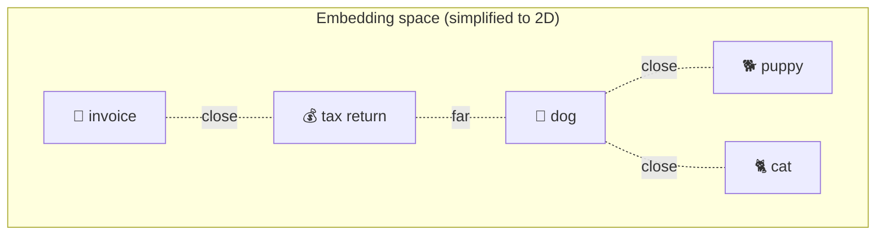
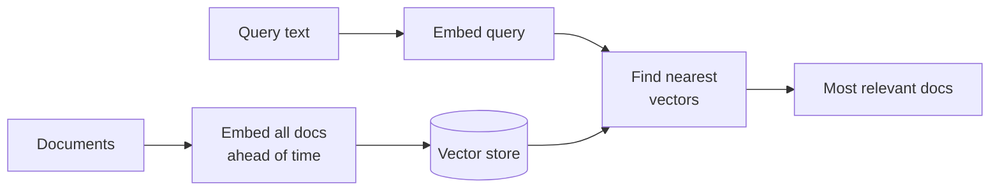

# Embeddings

> An embedding turns text into a list of numbers that captures its *meaning*, so a computer can
> measure how similar two pieces of text are. This is the foundation of search, RAG, and
> recommendations.

## Overview

Computers compare numbers, not meaning. An **embedding model** bridges that gap: it maps text
(or images, audio, code) into a vector — a fixed-length list of numbers — positioned so that
similar meanings land close together. "Dog" and "puppy" end up near each other; "dog" and
"tax return" end up far apart. Once meaning is geometry, *finding related content becomes finding
nearby points.*

## Learning Objectives

By the end of this page you will be able to:

- Explain what an embedding is and what "close together" means.
- Compute similarity between two texts.
- Describe how embeddings power semantic search and [RAG](../rag/index.md).
- Choose sensible defaults for an embedding model.

## Theory

### Meaning as coordinates

Imagine placing every word on a map where distance reflects meaning. Real embeddings do this in
hundreds or thousands of dimensions (not 2), but the intuition holds:



Each piece of text becomes a point. The **direction** and **position** encode meaning, learned
from how words are used across massive amounts of text.

### Measuring similarity: cosine

The most common similarity measure is **cosine similarity** — the cosine of the angle between
two vectors. It ignores length and focuses on *direction* (meaning):

- **1.0** → same direction (very similar meaning)
- **0.0** → unrelated (perpendicular)
- **-1.0** → opposite

```python title="cosine.py"
import numpy as np

def cosine_similarity(a: np.ndarray, b: np.ndarray) -> float:
    return float(np.dot(a, b) / (np.linalg.norm(a) * np.linalg.norm(b)))
```

### From similarity to search

This unlocks **semantic search** — finding by *meaning*, not keywords. A query for "how do I
reset my password?" can match a document titled "Recovering account access," even with no shared
words, because their embeddings are close.



This exact pipeline is the retrieval half of [RAG](../rag/index.md): embed your documents once,
store the vectors, then embed each query and fetch the nearest chunks.

### Embeddings vs. the LLM

They're different tools, often used together:

| | **Embedding model** | **Generative LLM** |
|---|---|---|
| Output | A vector (numbers) | Text |
| Job | Represent meaning for comparison | Generate/reason over text |
| Used for | Search, RAG retrieval, clustering, dedup | Answering, writing, tool use |

## Practical Example

Embed a few sentences and rank them by similarity to a query:

```python title="semantic_search.py"
import numpy as np
from anthropic import Anthropic  # or use a dedicated embeddings provider

# NOTE: use any embeddings API (Voyage, OpenAI, Cohere, or a local model).
# The shape is always the same: text in → vector out.
from voyageai import Client as VoyageClient  # example embeddings provider

vo = VoyageClient()

def embed(texts: list[str]) -> np.ndarray:
    result = vo.embed(texts, model="voyage-3", input_type="document")
    return np.array(result.embeddings)

def cosine(a, b):
    return float(np.dot(a, b) / (np.linalg.norm(a) * np.linalg.norm(b)))

docs = [
    "How to reset your password",
    "Our refund policy for orders",
    "Recovering access to a locked account",
]
query = "I forgot my login credentials"

doc_vecs = embed(docs)
q_vec = embed([query])[0]

ranked = sorted(
    ((cosine(q_vec, d), doc) for d, doc in zip(doc_vecs, docs)),
    reverse=True,
)
for score, doc in ranked:
    print(f"{score:.3f}  {doc}")
# The password/account docs score highest — no shared keywords required.
```

!!! tip "You precompute document embeddings once"
    Embedding your corpus is a one-time (or on-update) job. At query time you only embed the
    query and compare — which is fast. A [vector database](../rag/vector-databases.md) makes the
    "find nearest" step efficient at scale.

## Best Practices

- ✅ Use the **same embedding model** for documents and queries — vectors from different models
  aren't comparable.
- ✅ Normalize vectors if your similarity metric or database expects it.
- ✅ Pick an embedding model sized to your needs (dimension, cost, language/domain support).
- ✅ Store metadata (source, chunk id) alongside vectors so you can trace results back.

## Common Mistakes

- ❌ Mixing embeddings from different models or versions in one index.
- ❌ Assuming high similarity means *correct answer* — it means *related text*; the LLM still
  has to use it well.
- ❌ Embedding huge documents whole instead of [chunking](../rag/chunking.md) them.
- ❌ Forgetting that embeddings capture the model's training biases too.

## Exercises

1. Embed five sentences and build a similarity matrix. Do the clusters match your intuition?
2. Find a case where keyword search fails but semantic search succeeds (different words, same
   meaning).
3. Compare two embedding models on the same queries. How do rankings differ?

## References

- [Anthropic — Embeddings](https://docs.anthropic.com/en/docs/build-with-claude/embeddings)
- [Cohere — What are embeddings?](https://cohere.com/llmu/text-embeddings)
- [MTEB leaderboard](https://huggingface.co/spaces/mteb/leaderboard) — compare embedding models
- Next in Bee: [RAG](../rag/index.md) · [Vector Databases](../rag/vector-databases.md)
