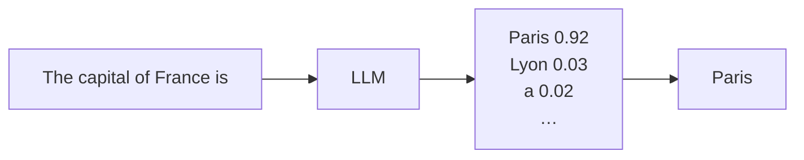
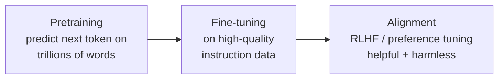

# How LLMs Work

> A large language model is a next-token predictor. That one idea, scaled up enormously, explains
> almost everything these systems can and can't do.

## Overview

Strip away the hype and a large language model (LLM) does something surprisingly simple:
**given some text, predict the next token.** Repeat that prediction, feeding each new token back
in, and you get fluent paragraphs, working code, and step-by-step reasoning. This page explains
how that works, why it's so capable, and what limitations fall directly out of the design.

## Learning Objectives

By the end of this page you will be able to:

- Explain next-token prediction and autoregressive generation.
- Describe (at a high level) how models are trained and aligned.
- Connect the design to real behaviors: context limits, hallucination, and cost.
- Reason about why prompting works at all.

## Theory

### It's a very good autocomplete

At its core, an LLM estimates a probability distribution over the next token given everything
before it:

$$P(\text{next token} \mid \text{all previous tokens})$$

Don't let the notation scare you — it just says: *"given the text so far, how likely is each
possible next token?"* The model assigns a probability to every token in its vocabulary, then
one is chosen.



### Autoregressive generation: one token at a time

The model doesn't write a whole answer at once. It predicts one token, appends it to the input,
and predicts again — a loop called **autoregressive generation**:

```text
"The capital of France is"        → "Paris"
"The capital of France is Paris"  → "."
"The capital of France is Paris." → <end>
```

This is why:

- **Responses stream** naturally (each token is produced in sequence).
- **Longer outputs cost more** (each token is a separate prediction).
- **Early mistakes compound** — a wrong token becomes part of the input for the next one.

### How the probabilities get chosen: sampling

The model gives probabilities; a **sampling** step picks the actual token. Two knobs matter:

- **Temperature** — flattens or sharpens the distribution. Low (`0`) almost always picks the
  most likely token (consistent, good for extraction). High (`~1`) allows less likely tokens
  (creative, more varied).
- **Top-p / top-k** — restrict sampling to the most probable tokens, trading diversity for
  coherence.

!!! note "Why the same prompt can give different answers"
    Unless temperature is 0 (and even then, not always guaranteed), sampling introduces
    randomness. This is a feature for creativity and a challenge for reliability — which is why
    [evaluation](../evaluation/index.md) matters.

### Where the "knowledge" comes from: training

Training happens in stages:



1. **Pretraining** — the model reads a vast slice of the internet, books, and code, learning to
   predict the next token. In doing so it absorbs grammar, facts, reasoning patterns, and coding
   conventions — not because it was told to, but because predicting text well *requires* them.
2. **Fine-tuning** — it's further trained on curated examples of following instructions, so it
   behaves like a helpful assistant rather than raw autocomplete.
3. **Alignment (RLHF / preference tuning)** — humans (or models trained on human preferences)
   rank outputs, and the model is nudged toward the preferred ones — more helpful, honest, and
   harmless.

### Why next-token prediction is so powerful

To predict the next token well across *all* of human text, a model must implicitly learn a
staggering range of skills: syntax, world facts, translation, arithmetic patterns, code
structure, and chains of reasoning. Capability emerges as a *side effect* of getting very good
at a simple objective, at enormous scale. This is the surprising bet that paid off.

## The design explains the limitations

Almost every "gotcha" traces back to how LLMs work:

| Behavior | Why it happens |
|----------|----------------|
| **Hallucination** | The model optimizes for *plausible* next tokens, not *true* ones. Fluent ≠ factual. |
| **Context window limits** | It can only attend to a fixed number of tokens; older content falls out of view. |
| **"Forgetting" earlier chat** | Once tokens leave the context window, they're gone unless re-supplied. |
| **Knowledge cutoff** | It only knows what was in its training data, up to a point in time. |
| **Sensitivity to phrasing** | Different inputs shift the probability distribution — hence [prompt engineering](../prompting/prompt-engineering.md). |
| **Can't truly "do math"** | It pattern-matches numeric tokens; for reliable math, give it a [tool](../prompting/function-calling.md). |

These aren't bugs to be angry at — they're the shape of the tool. Good AI engineering works
*with* them: [RAG](../rag/index.md) supplies fresh facts, [tools](../prompting/function-calling.md)
handle exact computation, and [evaluation](../evaluation/index.md) catches regressions.

## Practical Example

Watch next-token prediction directly by inspecting probabilities. Many APIs expose
`logprobs`-style data; here's the intuition in pseudocode you can adapt:

```python title="intuition.py"
# Conceptual: the model returns a distribution; sampling picks one token, then repeats.
context = "The capital of France is"
for _ in range(3):
    distribution = model.predict_next_token(context)   # {token: probability, ...}
    next_token = sample(distribution, temperature=0.0)  # pick most likely
    context += next_token
    print(repr(context))
# 'The capital of France is Paris'
# 'The capital of France is Paris.'
# 'The capital of France is Paris.<end>'
```

The real API hides the loop — you call it once and it streams the tokens — but this is exactly
what's happening underneath.

## Best Practices

- ✅ Treat the model as a reasoning engine, not a database — supply facts via
  [RAG](../rag/index.md) or tools when accuracy matters.
- ✅ Use low temperature for tasks that must be consistent; higher for creative ones.
- ✅ Keep important context *inside* the window; don't assume the model remembers old turns.
- ✅ Budget tokens — every output token is a separate, billed prediction.

## Common Mistakes

- ❌ Believing confident output is correct output — fluency is not truth.
- ❌ Expecting the model to know events after its training cutoff.
- ❌ Relying on the model for exact arithmetic or up-to-the-minute facts without a tool.
- ❌ Assuming a longer prompt is always "remembered" — it must fit the context window.

## Exercises

1. Ask a model the same creative question at `temperature=0` and `temperature=1`, five times
   each. Describe how consistency changes.
2. Ask about a very recent event. Notice the knowledge-cutoff limitation, then think about how
   [RAG](../rag/index.md) would fix it.
3. Ask the model to multiply two large numbers, then verify with a calculator. When does it slip?

## References

- [Anthropic — Introduction to Claude](https://docs.anthropic.com/en/docs/intro-to-claude)
- ["Attention Is All You Need"](https://arxiv.org/abs/1706.03762) — the transformer paper
- [The Illustrated GPT-2](https://jalammar.github.io/illustrated-gpt2/) — visual intuition
- Next in Bee: [Tokenization](tokenization.md) · [The Transformer](transformers.md)
