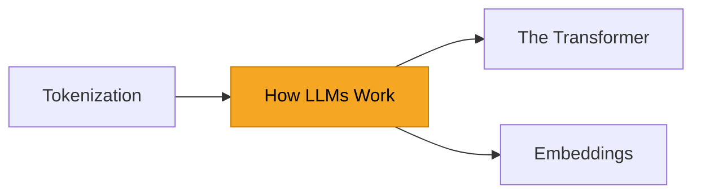

# Concepts — The Foundations

> Everything else in Bee builds on these ideas. Understand them once and the rest of AI
> engineering clicks into place.

## Overview

You can build a lot by treating an LLM as a magic box. But the moment something goes wrong — a
weird truncation, a surprising cost, a model that "forgets" — you need a mental model of what's
actually happening. This section gives you that model, from first principles, without requiring
heavy math.

## What you'll learn

- :material-brain:{ .lg .middle } **[How LLMs Work](how-llms-work.md)**

    ---

    Next-token prediction, training, and why it produces such general capabilities. Start here.

- :material-scissors-cutting:{ .lg .middle } **[Tokenization](tokenization.md)**

    ---

    Models don't see characters or words — they see tokens. This explains cost, limits, and odd
    behavior.

- :material-graph:{ .lg .middle } **[The Transformer](transformers.md)**

    ---

    The architecture behind every modern LLM, explained through the intuition of *attention*.

- :material-vector-line:{ .lg .middle } **[Embeddings](embeddings.md)**

    ---

    Turning meaning into numbers — the foundation of search, RAG, and similarity.

## Learning Objectives

By the end of this section you will be able to:

- Explain what an LLM is doing when it generates text.
- Reason about token limits and cost.
- Describe the transformer's attention mechanism in plain language.
- Explain what embeddings are and why they power search and RAG.

## Suggested order

If you're new, read them in the order above. If you're here for RAG or agents, at minimum read
[How LLMs Work](how-llms-work.md) and [Embeddings](embeddings.md).

!!! tip
    This is a 🟢 **Beginner** section — it assumes general programming knowledge but no machine
    learning background. Math is offered as *optional depth*, never as a prerequisite.
