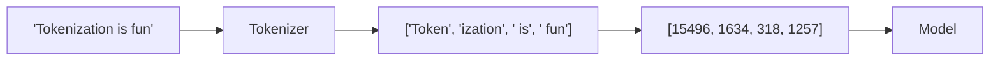
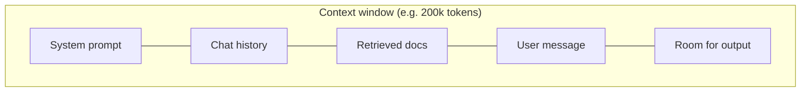

# Tokenization

> Models don't read characters or words — they read **tokens**. Understanding tokens explains your
> bill, your context limits, and a whole class of "weird" model behavior.

## Overview

Before an LLM sees your text, a **tokenizer** chops it into tokens — chunks that are often
word-pieces (roughly ¾ of a word on average in English). The model works entirely in these
units. Everything downstream — cost, context limits, and some surprising failures — is measured
in tokens, so this small concept has outsized practical importance.

## Learning Objectives

By the end of this page you will be able to:

- Explain what a token is and why models use subword units.
- Estimate token counts and therefore cost.
- Diagnose token-related issues (truncation, context limits, odd character handling).

## Theory

### Why not just use words or characters?

- **Characters** are too fine — sequences get very long, and the model wastes capacity learning
  to spell.
- **Words** are too coarse — the vocabulary would be enormous and couldn't handle new or
  misspelled words.

**Subword tokenization** is the sweet spot. Common words become single tokens; rare words split
into pieces. This keeps the vocabulary manageable (typically ~50k–200k tokens) while handling
any input.



Note two things in that example:

1. **"Tokenization" splits** into `Token` + `ization` — a rare-ish word broken into pieces.
2. **The leading space is part of the token** (` is`, ` fun`). Tokenizers usually attach spaces
   to the following word, which is why spacing can subtly affect behavior.

### Rough rules of thumb (English)

- **1 token ≈ 4 characters ≈ ¾ of a word.**
- **100 tokens ≈ 75 words.**
- A dense page of text ≈ 500–800 tokens.

These are approximations — code, numbers, and other languages tokenize differently (often less
efficiently).

### Tokens = money and limits

Two of the most practical facts in AI engineering:

1. **You are billed per token** — both input (your prompt) and output (the response), usually at
   different rates.
2. **The context window is measured in tokens** — the model can only "see" a fixed number at
   once (prompt + response combined). Exceed it and content is dropped or the call errors.



If you cram huge documents into the prompt, you pay for every token *and* risk crowding out
room for the answer. This is a core reason [RAG](../rag/index.md) exists — retrieve only the
relevant chunks instead of stuffing everything in.

### Why tokenization causes "weird" behavior

- **Counting letters** ("how many 'r's in strawberry?") is hard because the model sees tokens,
  not letters.
- **Arithmetic** on long numbers is unreliable — digits get grouped into tokens inconsistently.
- **Non-English and code** often use more tokens per idea, costing more and filling context
  faster.

These make more sense once you remember: the model never sees the raw characters you do.

## Practical Example

Count tokens before you send a request so you can predict cost and stay within limits:

```python title="count_tokens.py"
# Anthropic exposes a token-counting endpoint so you can measure before sending.
from anthropic import Anthropic

client = Anthropic()

result = client.messages.count_tokens(
    model="claude-sonnet-5",
    messages=[{"role": "user", "content": "Tokenization is fun!"}],
)
print(f"Input tokens: {result.input_tokens}")
```

For OpenAI models, the [`tiktoken`](https://github.com/openai/tiktoken) library counts locally:

```python title="tiktoken_example.py"
import tiktoken

enc = tiktoken.get_encoding("o200k_base")
tokens = enc.encode("Tokenization is fun!")
print(tokens)              # e.g. [2438, 2065, 382, 2523, 0]
print(f"{len(tokens)} tokens")
```

!!! tip "See it yourself"
    Paste text into a visual tokenizer (e.g. the OpenAI tokenizer playground) and watch words
    split into colored token chunks. It builds intuition fast.

## Best Practices

- ✅ Estimate tokens before sending large prompts — it's your cost and limit budget.
- ✅ Prefer retrieving relevant chunks ([RAG](../rag/index.md)) over stuffing whole documents.
- ✅ Leave headroom in the context window for the output.
- ✅ For exact character/number tasks, use a [tool](../prompting/function-calling.md) instead of
  trusting the model.

## Common Mistakes

- ❌ Assuming "context window" means characters or words — it's tokens.
- ❌ Forgetting output tokens count toward both cost and the window.
- ❌ Blaming the model for miscounting letters — that's a tokenization artifact.
- ❌ Assuming token counts transfer across providers — each has its own tokenizer.

## Exercises

1. Count the tokens in a paragraph of English, the same paragraph translated to another
   language, and a code snippet of similar length. Compare — which is most token-hungry?
2. Estimate the cost of a 2,000-word input + 500-word output using your provider's per-token
   prices.
3. Take a 300,000-token document and a 200k-token context window. How would you fit it? (Hint:
   this is the motivation for [chunking](../rag/chunking.md).)

## References

- [tiktoken](https://github.com/openai/tiktoken) — OpenAI's tokenizer library
- [Anthropic — Token counting](https://docs.anthropic.com/en/docs/build-with-claude/token-counting)
- [Hugging Face — Summary of tokenizers](https://huggingface.co/docs/transformers/tokenizer_summary)
- Next in Bee: [The Transformer](transformers.md)
