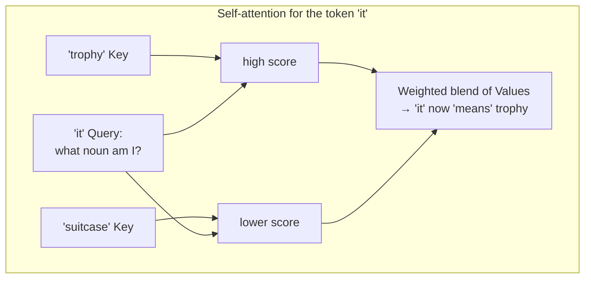
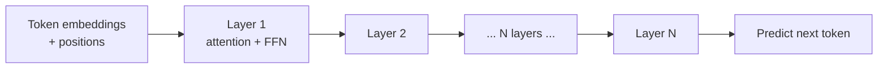

# The Transformer

> The architecture behind every modern LLM. You don't need the math to build with it — but the
> intuition behind **attention** will make model behavior far less mysterious.

## Overview

In 2017 a paper titled ["Attention Is All You Need"](https://arxiv.org/abs/1706.03762)
introduced the **transformer** — the architecture that powers GPT, Claude, Gemini, Llama, and
essentially every modern LLM. Its key innovation, **self-attention**, lets a model weigh the
relationships between all words in a sequence at once. This page builds that intuition without
requiring linear algebra.

## Learning Objectives

By the end of this page you will be able to:

- Explain self-attention in plain language.
- Describe how tokens flow through a transformer to produce a next-token prediction.
- Understand why context length is computationally expensive.
- Relate architecture choices to practical behavior.

## Theory

### The problem attention solves

Consider: *"The trophy didn't fit in the suitcase because **it** was too big."*

What does "it" refer to — the trophy or the suitcase? You resolve this instantly using context.
Older models processed words in order and struggled to connect distant, related words.
**Attention lets every token look at every other token and decide what's relevant** — so "it"
can attend strongly to "trophy."

### Self-attention, intuitively

For each token, the model asks: *"To understand this token, which other tokens should I focus
on, and how much?"* It answers using three learned roles for every token:

| Role | Analogy | Purpose |
|------|---------|---------|
| **Query** | "What am I looking for?" | What this token wants to know |
| **Key** | "What do I offer?" | What each token can provide |
| **Value** | "Here's my content" | The information that gets passed along |

Each token's **query** is compared against every token's **key** to produce attention scores
(how relevant each other token is). Those scores weight the **values**, which are summed to form
a new, context-enriched representation of the token.



> [!NOTE]
> "Self"-attention means tokens attend to *other tokens in the same sequence*. This is the whole
> trick: relationships are computed directly, regardless of distance.

### Stacking it up: the full model

A transformer stacks many **layers**, each containing:

1. **Multi-head attention** — several attention operations run in parallel ("heads"), each free
   to focus on different kinds of relationships (grammar, coreference, topic).
2. **A feed-forward network** — processes each token's enriched representation further.
3. **Residual connections + normalization** — engineering that keeps deep networks trainable.



Because attention has no inherent sense of order, the model adds **positional information** to
each token so it knows *where* words are, not just *which* words are present.

After the final layer, the model produces a probability distribution over the next token — the
next-token prediction from [How LLMs Work](how-llms-work.md).

### Why context length is expensive

In standard self-attention, every token attends to every other token. For a sequence of _n_
tokens, that's roughly _n²_ comparisons. Double the context and you roughly *quadruple* the
attention compute. This is why:

- Long context windows are a genuine engineering achievement.
- Very long prompts are slower and costlier.
- A lot of research (sparse/flash attention, etc.) targets making this cheaper.

## Practical Example

You rarely implement attention yourself, but you can *observe* its consequences. Ask a model to
resolve ambiguous references and it usually nails them — that's attention connecting distant
tokens:

```python title="attention_in_action.py"
from anthropic import Anthropic

client = Anthropic()
resp = client.messages.create(
    model="claude-sonnet-5",
    max_tokens=100,
    messages=[{"role": "user", "content":
        "The trophy didn't fit in the suitcase because it was too big. "
        "What was too big, and how do you know?"}],
)
print(resp.content[0].text)
# The model explains "it" = the trophy — attention linked the pronoun to the right noun.
```

## Encoder, decoder — which one is a chatbot?

You'll hear three flavors. Modern chat LLMs are **decoder-only**:

| Type | Reads | Example use |
|------|-------|-------------|
| **Encoder-only** | Whole input at once (bidirectional) | Embeddings, classification (e.g. BERT) |
| **Decoder-only** | Left-to-right, generates text | Chat LLMs (GPT, Claude, Llama) |
| **Encoder-decoder** | Encodes input, decodes output | Translation, summarization (e.g. T5) |

## Best Practices

- ✅ Put the most important context where it's easy to attend to — clear structure helps.
- ✅ Remember long contexts cost more than linearly; retrieve, don't dump
  ([RAG](../rag/index.md)).
- ✅ Use the mental model, not the math, to debug behavior — "can the model *see* the info it
  needs?"

## Common Mistakes

- ❌ Assuming the model reads like a human (front to back, remembering everything) — it attends
  to a fixed window.
- ❌ Thinking bigger context is free — it's computationally quadratic.
- ❌ Believing you must understand the math to build well — you don't; intuition suffices for
  most engineering.

## Exercises

1. Explain self-attention to a friend in two sentences using the Query/Key/Value analogy.
2. Estimate: if attention is ~n², how much more attention compute does a 100k-token prompt need
   than a 10k-token one?
3. Read the abstract of ["Attention Is All You Need"](https://arxiv.org/abs/1706.03762) and list
   one thing that now makes sense.

## References

- ["Attention Is All You Need"](https://arxiv.org/abs/1706.03762) — the original paper
- [The Illustrated Transformer](https://jalammar.github.io/illustrated-transformer/) — the classic visual guide
- [3Blue1Brown — Transformers explained](https://www.youtube.com/watch?v=wjZofJX0v4M) — video intuition
- Next in Bee: [Embeddings](embeddings.md)
