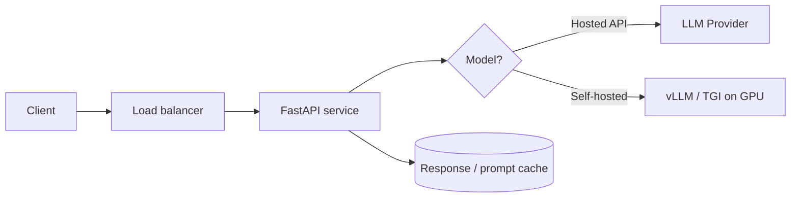

# Deployment

> Taking an AI feature from your laptop to a reliable, scalable service — packaging, serving,
> and scaling.

## Overview

Deploying an LLM app is mostly normal backend engineering plus a few AI-specific concerns:
**streaming responses**, **long request times**, **token-based cost**, and (if you self-host
models) **GPU serving**.



## Two deployment models

| | **Hosted API** (recommended default) | **Self-hosted model** |
|---|---|---|
| Setup | Call a provider's API | Run vLLM/TGI/Ollama on your hardware |
| Cost | Per token | Per GPU-hour (+ ops) |
| Best for | Most apps, fast iteration | Data control, high volume, custom models |
| Complexity | Low | High (GPUs, scaling, quantization) |

Start with hosted APIs. Self-host only when data residency, cost at scale, or a custom model
justifies the operational burden.

## Learning Objectives

By the end of this section you will be able to:

- Package an LLM app with Docker.
- Serve streaming responses correctly (SSE) behind a load balancer.
- Decide between hosted and self-hosted serving.
- Apply caching and autoscaling to control cost and latency.

## Quick taste: a production-ready container

```dockerfile title="Dockerfile"
FROM python:3.12-slim
WORKDIR /app
COPY pyproject.toml .
RUN pip install --no-cache-dir .
COPY . .
# Never bake secrets into the image — inject at runtime.
EXPOSE 8000
CMD ["uvicorn", "app.main:app", "--host", "0.0.0.0", "--port", "8000"]
```

## Best Practices

- ✅ Inject secrets at runtime (env vars/secret manager), never in the image.
- ✅ Stream responses (Server-Sent Events) so users see output immediately.
- ✅ Set sensible timeouts — LLM calls can take many seconds.
- ✅ Cache where you can (identical prompts, embeddings) to cut cost and latency.
- ✅ Add health checks, graceful shutdown, and retries with backoff.

## Common Mistakes

- ❌ Self-hosting a model before you need to — huge ops cost for little benefit.
- ❌ Short default timeouts that kill legitimate long generations.
- ❌ No cost controls — a bug or abuse can run up a large bill fast.
- ❌ Baking API keys into Docker images or committing them.

## 🐝 Help build this section

Claim a topic by [opening an issue](https://github.com/bee-ai-labs/bee/issues/new/choose):

- `[WANTED]` **FastAPI + streaming LLM service** — full runnable template 🟡
- `[WANTED]` **Serving models with vLLM** — throughput, batching 🔴
- `[WANTED]` **Kubernetes for AI services** — autoscaling, GPUs 🔴
- `[WANTED]` **Quantization for cheaper inference** — GGUF, AWQ, GPTQ 🔴
- `[WANTED]` **Caching strategies** — prompt/response/embedding caches 🟡

## References

- [vLLM documentation](https://docs.vllm.ai/)
- [FastAPI](https://fastapi.tiangolo.com/)
- [Anthropic — Prompt caching](https://docs.anthropic.com/en/docs/build-with-claude/prompt-caching)
