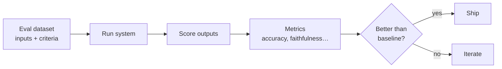

# Evaluation

> How do you know if your AI system is *good* — and whether your latest change made it better or
> worse? Evaluation is the discipline that answers that.

## Overview

Traditional software has deterministic tests: given input X, assert output Y. LLMs break that —
the same prompt can produce different, equally-valid outputs. **Evaluation is how you regain
confidence** in a non-deterministic system.

Without evals, you're "vibe-checking" — changing a prompt, eyeballing a few outputs, and hoping.
With evals, every change is measured.

## Learning Objectives

By the end of this section you will be able to:

- Build an evaluation dataset that reflects real usage.
- Choose the right scoring method (exact match, rubric, LLM-as-judge).
- Detect regressions before they reach users.
- Evaluate RAG and agents, not just single completions.

## The three ways to score

| Method | Good for | Watch out for |
|--------|----------|---------------|
| **Exact / rule-based** | Classification, extraction, format checks | Too rigid for open-ended text |
| **LLM-as-judge** | Open-ended quality, helpfulness, tone | Judge bias; needs its own validation |
| **Human review** | Ground truth, high-stakes | Slow and expensive; use sparingly |

## Best Practices

- ✅ Build your eval set from **real** (or realistic) inputs, including edge cases and failures.
- ✅ Version your eval set and track scores over time — treat it like a test suite.
- ✅ Validate your LLM judge against human labels before trusting it.
- ✅ Measure what matters to *users* (task success), not just proxy metrics.

## Common Mistakes

- ❌ Shipping prompt changes with no measurement ("it looked better").
- ❌ Overfitting to a tiny eval set that doesn't represent production.
- ❌ Trusting an LLM judge without checking it agrees with humans.
- ❌ Only measuring averages — the tail (worst cases) is often what hurts users.

## 🐝 Help build this section

Claim a topic by [opening an issue](https://github.com/bee-ai-labs/bee/issues/new/choose):

- `[WANTED]` **Building an eval harness** — datasets, runners, tracking 🟡
- `[WANTED]` **LLM-as-judge, done right** — rubrics, bias, validation 🔴
- `[WANTED]` **Detecting hallucinations** — groundedness/faithfulness metrics 🔴
- `[WANTED]` **Benchmarks explained** — MMLU, GSM8K, and their limits 🟡
- See also RAG's own [evaluation guide](../rag/evaluation.md).

## References

- [Anthropic — Building evals](https://docs.anthropic.com/en/docs/test-and-evaluate)
- [OpenAI Evals](https://github.com/openai/evals)
- [Ragas — RAG evaluation](https://docs.ragas.io/)
