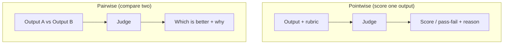

# LLM-as-Judge

> Using an LLM to grade LLM outputs. It scales evaluation of open-ended quality far beyond what
> humans can review by hand — but only if you validate the judge itself.

## Overview

Some outputs can't be graded by exact match — "is this summary good?", "is this answer helpful and
grounded?" Human review is the gold standard but slow and expensive. **LLM-as-judge** uses a model
to score outputs against a rubric, letting you evaluate thousands of cases cheaply. The catch: the
judge is itself a fallible LLM, so an unvalidated judge can give you confident, systematically
wrong scores. This page shows how to build a judge you can actually trust.

## Learning Objectives

By the end of this page you will be able to:

- Write an effective judge prompt with a clear rubric.
- Choose between pointwise scoring and pairwise comparison.
- Recognize and mitigate judge biases.
- Validate a judge against human labels before trusting it.

## Theory

### Two ways to judge



- **Pointwise:** score a single output (e.g. faithful? 1–5 helpfulness). Simple; good for
  pass/fail gates and tracking a metric over time.
- **Pairwise:** ask which of two outputs is better. Often *more reliable* than absolute scores —
  models are better at comparison than calibration — and ideal for comparing two prompts/models.

### Known judge biases (and fixes)

| Bias | What happens | Mitigation |
|------|--------------|------------|
| **Position bias** | Favors the first (or second) option in pairwise | Run both orders, average |
| **Verbosity bias** | Prefers longer answers | Rubric emphasizes correctness, not length |
| **Self-preference** | A model favors its own style | Use a different model as judge when possible |
| **Leniency** | Everything "looks fine" → scores cluster high | Force a rubric + require justification |

### The rubric is everything

Vague prompts ("rate 1–10") produce noisy, meaningless scores. A good judge prompt has: a
**specific criterion**, **explicit levels**, a request for a **short justification**, and a
**structured output** you can parse.

## Practical Example

### A faithfulness judge (pointwise, structured)

```python title="judge.py"
import json
from anthropic import Anthropic
from pydantic import BaseModel

client = Anthropic()

class Verdict(BaseModel):
    faithful: bool
    reason: str

JUDGE = """You evaluate whether an ANSWER is fully supported by the CONTEXT.
Rules:
- "faithful" is true ONLY if every factual claim in the answer is supported by the context.
- If the answer adds unsupported facts, faithful is false.
- Be strict. Judge support, not writing quality.

CONTEXT:
{context}

ANSWER:
{answer}"""

def judge_faithfulness(context: str, answer: str) -> Verdict:
    resp = client.messages.create(
        model="claude-sonnet-5", max_tokens=250, temperature=0,   # deterministic judging
        tools=[{"name": "verdict", "description": "Record the verdict.",
                "input_schema": Verdict.model_json_schema()}],
        tool_choice={"type": "tool", "name": "verdict"},
        messages=[{"role": "user",
                   "content": JUDGE.format(context=context, answer=answer)}],
    )
    tool_use = next(b for b in resp.content if b.type == "tool_use")
    return Verdict.model_validate(tool_use.input)

print(judge_faithfulness(
    context="The refund window is 30 days.",
    answer="You can get a refund within 30 days, and shipping is always free.",
))  # faithful=False — the shipping claim isn't in the context.
```

### Pairwise comparison with position-bias control

```python title="pairwise.py"
def better_of(question: str, a: str, b: str) -> str:
    """Return 'A', 'B', or 'tie', averaging both orders to cancel position bias."""
    def ask(first, second):
        prompt = (f"Question: {question}\n\nResponse 1:\n{first}\n\nResponse 2:\n{second}\n\n"
                  "Which response better answers the question? Reply only '1', '2', or 'tie'.")
        r = client.messages.create(model="claude-sonnet-5", max_tokens=10, temperature=0,
                                   messages=[{"role": "user", "content": prompt}])
        return r.content[0].text.strip().lower()

    first = ask(a, b)     # A shown first
    second = ask(b, a)    # B shown first (order flipped)
    # Reconcile: if the winner flips with order, it's effectively a tie.
    return "tie" if {"1", "2"} == {first, second} else ("A" if "1" in first else "B")
```

!!! warning "Validate the judge before you trust it"
    Hand-label 30–50 examples yourself, then run the judge on the same set. Measure agreement
    (e.g. accuracy vs. your labels). If the judge doesn't agree with humans, fix the rubric — do
    **not** build your evals on an unvalidated judge.

## Best Practices

- ✅ Give a specific rubric with explicit levels; require a written justification.
- ✅ Use `temperature=0` and structured output for consistent, parseable verdicts.
- ✅ Prefer pairwise for comparisons; control position bias by averaging both orders.
- ✅ Use a *different* model as judge than the one being judged when you can.
- ✅ Validate the judge against human labels; re-validate if you change the rubric.

## Common Mistakes

- ❌ "Rate this 1–10" with no rubric → noise dressed up as a metric.
- ❌ Trusting judge scores without ever checking them against humans.
- ❌ Ignoring position/verbosity bias in pairwise setups.
- ❌ Judging with the same model/prompt family and mistaking self-preference for quality.
- ❌ Non-zero temperature making verdicts irreproducible.

## Exercises

1. Write a helpfulness judge with a 1–4 rubric and justifications. Run it on 20 answers; read the
   justifications — do you agree?
2. Build a pairwise comparison and deliberately make one answer longer but worse. Does verbosity
   bias show up? Does averaging both orders help?
3. Hand-label 30 outputs, run your judge, and compute agreement. Improve the rubric until
   agreement is high.

## References

- [Anthropic — Building evals](https://docs.anthropic.com/en/docs/test-and-evaluate)
- ["Judging LLM-as-a-Judge" (MT-Bench)](https://arxiv.org/abs/2306.05685)
- Bee: [Evaluation overview](index.md) · [Evaluating RAG](../rag/evaluation.md)
