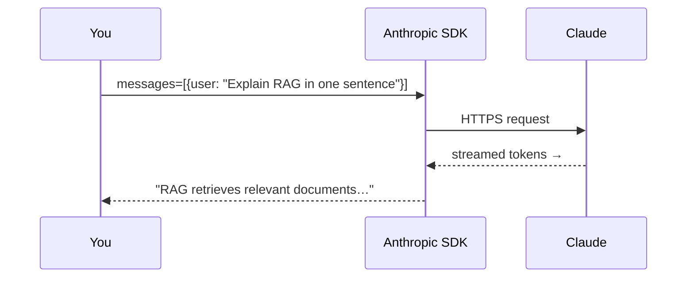

# Your First LLM Call

> Send a prompt to a large language model, get a response, and understand every line of code.

## Overview

An LLM API call is deceptively simple: you send **messages**, you get back **text**. But a few
concepts — roles, tokens, temperature, and streaming — show up in *every* AI application. We'll
meet them here in the smallest possible program.

## Learning Objectives

After this page you will be able to:

- Make a basic chat completion request.
- Explain the `system`, `user`, and `assistant` roles.
- Control output with `max_tokens` and `temperature`.
- Stream a response token-by-token.

## Theory: what actually happens

When you "call an LLM," you send a list of messages. Each message has a **role**:

| Role | Who it represents |
|------|-------------------|
| `system` | Instructions that shape the model's behavior (persona, rules, format) |
| `user` | What the human said |
| `assistant` | What the model said (in prior turns, for multi-turn chat) |

The model reads the whole conversation and predicts the next `assistant` message, one **token**
(≈ a word-piece) at a time. That's it. Everything else — RAG, agents, tools — is built on this
loop.



## Practical Example

```python title="first_call.py"
import os
from dotenv import load_dotenv
from anthropic import Anthropic

load_dotenv()  # loads ANTHROPIC_API_KEY from .env
client = Anthropic()  # reads the key from the environment automatically

response = client.messages.create(
    model="claude-sonnet-5",          # a fast, capable general-purpose model
    max_tokens=200,                   # cap the response length (controls cost)
    system="You are a concise technical teacher.",  # shapes behavior
    messages=[
        {"role": "user", "content": "Explain retrieval-augmented generation in one sentence."}
    ],
)

print(response.content[0].text)
print(f"\nTokens — in: {response.usage.input_tokens}, out: {response.usage.output_tokens}")
```

Run it:

```bash
python first_call.py
```

You'll see a one-sentence answer plus a token count. **Those token counts are your bill** — most
providers charge per input and output token, so tracking them is a production habit worth
forming early.

### Controlling the output

- **`max_tokens`** — a hard cap on the response length. Too low and you get cut off; too high
  wastes money on rambling.
- **`temperature`** (0.0–1.0) — randomness. `0` is nearly deterministic (good for extraction,
  classification); higher values are more creative (good for brainstorming).

```python
response = client.messages.create(
    model="claude-sonnet-5",
    max_tokens=200,
    temperature=0.0,   # deterministic — same input tends to give the same output
    messages=[{"role": "user", "content": "List three uses of embeddings."}],
)
```

### Streaming (so users see text as it's generated)

```python title="streaming.py"
with client.messages.stream(
    model="claude-sonnet-5",
    max_tokens=300,
    messages=[{"role": "user", "content": "Write a haiku about vector databases."}],
) as stream:
    for text in stream.text_stream:
        print(text, end="", flush=True)   # prints tokens as they arrive
print()
```

Streaming doesn't make the model faster — it makes the *experience* feel faster, because the
user reads the first words while the rest is still being generated.

!!! note "Using a different provider?"
    The SDK differs but the shape is identical: messages in, text out. OpenAI's
    `client.chat.completions.create(...)`, Google's `genai`, and local
    [Ollama](https://ollama.com/) all follow the same mental model.

## Best Practices

- ✅ Always set `max_tokens` — it's your primary cost guardrail.
- ✅ Use `temperature=0` for anything that should be consistent (parsing, classification).
- ✅ Stream for user-facing chat; buffer for background jobs.
- ✅ Log token usage from day one.

## Common Mistakes

- ❌ Hardcoding the API key instead of loading it from the environment.
- ❌ Forgetting `max_tokens`, then being surprised by a long, expensive response.
- ❌ Assuming `temperature=0` is *fully* deterministic — it's close, not guaranteed.
- ❌ Blocking the UI while waiting for a full response instead of streaming.

## Exercises

1. Change the `system` prompt to make the model answer as a pirate. Notice how much behavior the
   system prompt controls.
2. Set `temperature=1.0` and run the haiku prompt five times. How different are the outputs?
3. Print the cost of a call: multiply input/output tokens by your provider's per-token price.

## References

- [Anthropic Messages API](https://docs.anthropic.com/en/api/messages)
- [What are tokens?](../concepts/tokenization.md) — Bee's tokenization guide
- [Prompt Engineering](../prompting/prompt-engineering.md) — make your prompts better

---

Next: pick a [**Learning Path →**](../learning-paths/index.md) or dive into
[**How LLMs Work →**](../concepts/how-llms-work.md).
