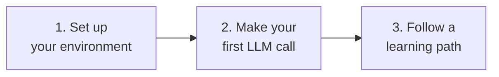

# Getting Started

New to AI engineering, or new to Bee? This short section gets you from zero to a working LLM
call and points you at the right learning path.

## The 3-step start

- :material-cog:{ .lg .middle } **1. Setup & Prerequisites**

    ---

    Python, a virtual environment, and an API key. Five minutes.

    [:octicons-arrow-right-24: Set up](setup.md)

- :material-message-text:{ .lg .middle } **2. Your First LLM Call**

    ---

    Send a prompt, get a response, understand every line.

    [:octicons-arrow-right-24: First call](first-llm-call.md)

- :material-map-marker-path:{ .lg .middle } **3. Pick a Path**

    ---

    A sequence that takes you from fundamentals to shipping.

    [:octicons-arrow-right-24: Learning paths](../learning-paths/index.md)

## What you need

- **Basic Python** — you can read and write functions, use `pip`/`uv`, and run scripts.
- **A terminal** — macOS, Linux, or Windows (WSL recommended on Windows).
- **An API key** from an LLM provider. The examples default to
  [Anthropic](https://console.anthropic.com/), but the concepts apply to any provider.

!!! note "No GPU required"
    Almost everything in Bee uses hosted APIs — no local GPU needed. The few sections that use
    local models say so explicitly and offer CPU-friendly options.

## What you *don't* need

- ❌ A machine learning degree
- ❌ Deep math (we build intuition first; math is optional depth)
- ❌ Expensive hardware

Ready? [**Set up your environment →**](setup.md)
