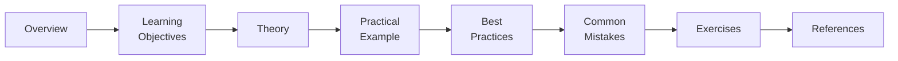

---
hide:
  - navigation
---

# Welcome to the Hive 🐝

**Bee is the open-source AI knowledge hive** — a community-built library of everything you need
to learn and build with modern AI. Clear theory, runnable examples, production patterns, and
guided learning paths, all held to one quality bar: **every page is finished and useful.**

- :material-school:{ .lg .middle } **Learn from first principles**

    ---

    Understand *why*, not just *how*. From how an LLM predicts the next token to how a
    multi-agent system plans.

    [:octicons-arrow-right-24: Start with Concepts](concepts/index.md)

- :material-run-fast:{ .lg .middle } **Everything runs**

    ---

    Each example is a self-contained project with pinned dependencies and tests. Clone it, add a
    key, run it.

    [:octicons-arrow-right-24: First LLM call](getting-started/first-llm-call.md)

- :material-map:{ .lg .middle } **Follow a path**

    ---

    Don't read randomly. Structured learning paths sequence content so each idea builds on the
    last.

    [:octicons-arrow-right-24: Learning paths](learning-paths/index.md)

- :material-account-group:{ .lg .middle } **Built by the community**

    ---

    Bee is owned by everyone who contributes. Fix a typo or write a tutorial — you belong here.

    [:octicons-arrow-right-24: Contribute](contributing/index.md)

## What you can learn here

- **🧠 Foundations** — [How LLMs work](concepts/how-llms-work.md), [transformers](concepts/transformers.md), [tokenization](concepts/tokenization.md), [embeddings](concepts/embeddings.md)
- **✍️ Prompting** — [prompt engineering](prompting/prompt-engineering.md), [system prompts](prompting/system-prompts.md), [structured outputs](prompting/structured-outputs.md), [tool calling](prompting/function-calling.md)
- **🔎 RAG** — [chunking](rag/chunking.md), [vector databases](rag/vector-databases.md), [hybrid search & reranking](rag/hybrid-search-reranking.md), [evaluation](rag/evaluation.md)
- **🤖 Agents** — [fundamentals](agents/fundamentals.md), [memory](agents/memory.md), [multi-agent](agents/multi-agent.md), [MCP](agents/mcp.md)
- **🏭 Production** — [evaluation](evaluation/index.md), [security](security/index.md), [deployment](deployment/index.md), [MLOps](mlops/index.md)

## How this site is organized

Every topic page follows the **same structure**, so you always know what to expect:

Content is tagged by difficulty so you can meet yourself where you are:

- 🟢 **Beginner** — assumes general programming knowledge only
- 🟡 **Intermediate** — assumes you've built basic LLM features
- 🔴 **Advanced** — assumes production experience

!!! tip "New here?"
    If you've never called an LLM API, start with
    [**Getting Started**](getting-started/index.md), then follow the
    [**AI Engineer — Fundamentals**](learning-paths/index.md) path. If you're experienced, jump
    straight to [RAG](rag/index.md) or [Agents](agents/index.md).

## A living project

Bee grows in public. See what's next on the [Roadmap](https://github.com/bee-ai-labs/bee/blob/main/ROADMAP.md),
join the conversation in [Discussions](https://github.com/bee-ai-labs/bee/discussions), and if Bee
helps you, ⭐ the [repository](https://github.com/bee-ai-labs/bee) so others can find the hive.

---

<em>Learn AI. Build AI. Share AI.</em> 🐝

