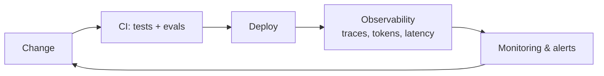

# MLOps for LLM Applications

> The operational practices that keep an AI system healthy in production: CI/CD, observability,
> monitoring, and cost control — sometimes called **LLMOps**.

## Overview

Once your AI feature is live, the questions change from "does it work?" to "is it *still*
working, for everyone, affordably?" LLMOps answers those with the same rigor as traditional
DevOps, plus AI-specific signals.

## Learning Objectives

By the end of this section you will be able to:

- Add evals to CI so quality regressions block a release.
- Trace an LLM request end-to-end (prompt, tools, retrieval, response).
- Monitor the metrics that matter: latency, error rate, token cost, quality.
- Control and forecast spend.

## The four things to watch

| Signal | Why it matters | Tooling |
|--------|----------------|---------|
| **Latency** | Slow responses feel broken | Tracing, percentiles (p50/p95/p99) |
| **Cost (tokens)** | The bill scales with usage | Per-request token logging, budgets |
| **Errors & retries** | Providers rate-limit and fail | Structured logs, alerting |
| **Quality** | Silent quality drops lose users | Online evals, user feedback |

## Best Practices

- ✅ Run your eval suite in CI — treat a quality regression like a failing test.
- ✅ Trace every request with a tool like [OpenTelemetry](https://opentelemetry.io/) /
  [Langfuse](https://langfuse.com/) so you can debug production.
- ✅ Log token usage per request; set budgets and alerts.
- ✅ Track percentiles, not just averages — the p99 is what angry users experience.
- ✅ Capture user feedback (👍/👎) as a cheap online quality signal.

## Common Mistakes

- ❌ Shipping prompt/model changes with no eval gate.
- ❌ No tracing — a bad response in production is then impossible to debug.
- ❌ Watching averages while the tail (p99 latency, worst-case cost) quietly hurts users.
- ❌ Discovering cost problems from the invoice instead of a dashboard.

## 🐝 Help build this section

Claim a topic by [opening an issue](https://github.com/bee-ai-labs/bee/issues/new/choose):

- `[WANTED]` **CI/CD for LLM apps** — evals as a release gate 🟡
- `[WANTED]` **Observability with OpenTelemetry/Langfuse** — traces + dashboards 🟡
- `[WANTED]` **Cost monitoring & budgets** — track and forecast spend 🟡
- `[WANTED]` **Prompt & model versioning** — reproducibility and rollback 🔴

## References

- [Langfuse — LLM observability](https://langfuse.com/docs)
- [OpenTelemetry](https://opentelemetry.io/docs/)
- Bee's [Evaluation](../evaluation/index.md) and [Deployment](../deployment/index.md) sections
