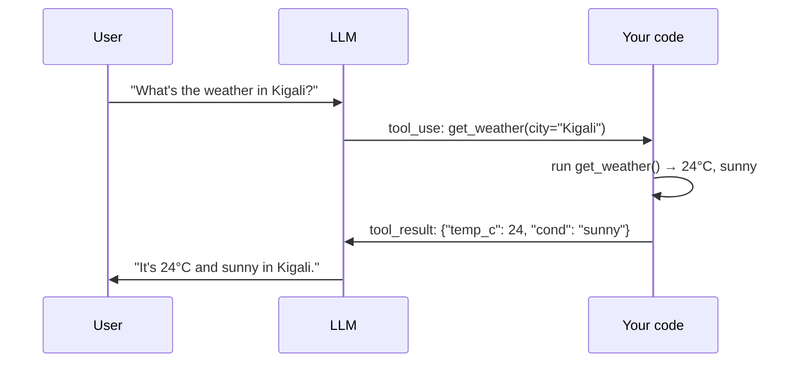

# Function & Tool Calling

> Tool calling lets a model *do* things — search a database, call an API, run a calculation —
> instead of only talking. It's the mechanism that turns an LLM into an [agent](../agents/index.md).

## Overview

On their own, LLMs can't look up today's weather, query your database, or reliably do arithmetic.
**Tool calling** (also "function calling") fixes this: you describe functions the model may use,
and when it decides one is needed, it returns a structured request to call it. *Your* code runs
the function and returns the result, which the model uses to continue. The model never runs your
code — it just asks.

## Learning Objectives

By the end of this page you will be able to:

- Define tools with a JSON schema and expose them to a model.
- Implement the full tool-use loop (request → execute → return → continue).
- Handle multiple tools and multi-step tool use.
- Apply the safety practices that make tool use production-ready.

## Theory

### The tool-use loop



The key insight: **the model requests, your code executes.** This separation is what makes tools
both powerful and safe — you control what actually runs.

### Defining a tool

A tool is a name, a description, and an input schema (same idea as
[structured outputs](structured-outputs.md)). The description matters a lot — it's how the model
decides *when* and *how* to use the tool.

```python title="define_tool.py"
get_weather_tool = {
    "name": "get_weather",
    "description": "Get the current weather for a city. Use when the user asks about weather.",
    "input_schema": {
        "type": "object",
        "properties": {
            "city": {"type": "string", "description": "City name, e.g. 'Kigali'"},
            "unit": {"type": "string", "enum": ["celsius", "fahrenheit"],
                     "default": "celsius"},
        },
        "required": ["city"],
    },
}
```

## Practical Example: the full loop

```python title="tool_loop.py"
import json
from anthropic import Anthropic

client = Anthropic()

# 1. Your real implementation (could call a weather API).
def get_weather(city: str, unit: str = "celsius") -> dict:
    return {"city": city, "temp": 24, "unit": unit, "condition": "sunny"}

TOOLS = [{
    "name": "get_weather",
    "description": "Get current weather for a city.",
    "input_schema": {
        "type": "object",
        "properties": {"city": {"type": "string"},
                       "unit": {"type": "string", "enum": ["celsius", "fahrenheit"]}},
        "required": ["city"],
    },
}]

def run(user_message: str) -> str:
    messages = [{"role": "user", "content": user_message}]

    while True:
        resp = client.messages.create(
            model="claude-sonnet-5", max_tokens=500, tools=TOOLS, messages=messages,
        )
        messages.append({"role": "assistant", "content": resp.content})

        if resp.stop_reason != "tool_use":
            # No tool needed (or done) — return the text answer.
            return "".join(b.text for b in resp.content if b.type == "text")

        # 2. Execute each requested tool and feed results back.
        tool_results = []
        for block in resp.content:
            if block.type == "tool_use":
                result = get_weather(**block.input)          # dispatch to your function
                tool_results.append({
                    "type": "tool_result",
                    "tool_use_id": block.id,
                    "content": json.dumps(result),
                })
        messages.append({"role": "user", "content": tool_results})
        # 3. Loop: the model now sees the results and continues.

print(run("What's the weather in Kigali, and should I bring an umbrella?"))
```

The `while` loop is essential: the model may call tools multiple times (e.g. look up two cities,
then compare) before producing a final answer. This loop is, quite literally, the core of an
[agent](../agents/fundamentals.md).

### Dispatching many tools

In real apps you register several tools and dispatch by name:

```python
TOOL_IMPL = {"get_weather": get_weather, "search_orders": search_orders}

def execute(block):
    fn = TOOL_IMPL[block.name]         # look up by the model's chosen name
    return fn(**block.input)
```

## Safety: tools are power, so gate them

> [!CAUTION]
> A tool that can send email, delete records, or spend money is a real-world action triggered by
> model output — which can be influenced by [prompt injection](../security/index.md). Apply
> **least privilege** (only the tools/scopes needed), **validate tool inputs** before executing,
> and require **human confirmation** for irreversible or high-impact actions.

- ✅ Validate and sanitize tool inputs — never pass model output straight into SQL, shell, or
  file paths.
- ✅ Scope credentials narrowly; a read tool shouldn't have write access.
- ✅ Confirm destructive actions with a human.
- ✅ Set timeouts and handle tool errors — return an error result so the model can react.

## Best Practices

- ✅ Write clear tool descriptions — they're the model's instructions for *when* to use them.
- ✅ Keep the tool set small and focused; too many tools confuse the model.
- ✅ Return structured, informative results (including errors) so the model can recover.
- ✅ Cap the loop iterations to avoid runaway tool-calling.

## Common Mistakes

- ❌ Vague tool descriptions → the model calls the wrong tool or none.
- ❌ Executing tool inputs without validation → injection and errors.
- ❌ No iteration cap → infinite or expensive tool loops.
- ❌ Swallowing tool errors → the model can't tell something failed.
- ❌ Giving powerful tools without human-in-the-loop for risky actions.

## Exercises

1. Add a `calculator` tool and ask a question requiring arithmetic. Confirm the model uses the
   tool instead of guessing.
2. Register two tools and craft a question that needs both. Watch the loop call them in sequence.
3. Make a tool raise an error and return it as a `tool_result`. Does the model recover gracefully?

## References

- [Anthropic — Tool use](https://docs.anthropic.com/en/docs/build-with-claude/tool-use)
- [OpenAI — Function calling](https://platform.openai.com/docs/guides/function-calling)
- Next in Bee: [Agent Fundamentals](../agents/fundamentals.md) · [MCP](../agents/mcp.md)
