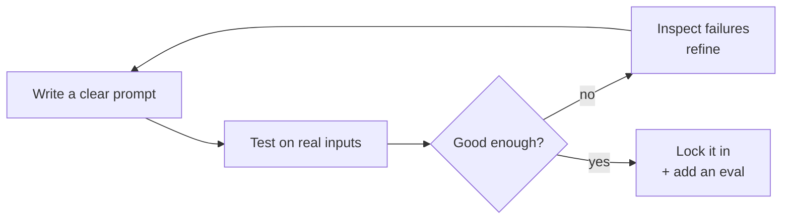

# Prompting

> The prompt is your primary interface to an LLM. Prompting well is the highest-leverage,
> lowest-cost skill in AI engineering — and the first one worth mastering.

## Overview

Before you reach for fine-tuning, RAG, or agents, you reach for the prompt. Small changes in how
you ask can be the difference between an unusable feature and a shippable one — at zero
additional infrastructure cost. This section takes you from writing clear instructions to getting
reliable, structured, tool-using behavior.

## What you'll learn

- :material-lightbulb-on:{ .lg .middle } **[Prompt Engineering](prompt-engineering.md)**

    ---

    The core techniques: clarity, examples, chain-of-thought, and iteration. Start here.

- :material-card-account-details:{ .lg .middle } **[System Prompts](system-prompts.md)**

    ---

    Set persona, rules, and format once — for the whole conversation.

- :material-code-json:{ .lg .middle } **[Structured Outputs](structured-outputs.md)**

    ---

    Get reliable JSON you can parse, validate, and build on.

- :material-function-variant:{ .lg .middle } **[Function & Tool Calling](function-calling.md)**

    ---

    Let the model *do* things: search, calculate, call your APIs.

## Learning Objectives

By the end of this section you will be able to:

- Write clear, well-structured prompts that reliably get good results.
- Use system prompts to control behavior across a conversation.
- Force structured, machine-readable output and validate it.
- Give a model tools and handle its tool calls safely.

## The prompting mindset

Prompting is empirical. Write, test on realistic inputs, inspect failures, refine. When it's
good, protect it with an [evaluation](../evaluation/index.md) so future changes don't regress it.

!!! tip "Escalation ladder"
    Reach for the cheapest tool that solves the problem, in this order: **prompt →
    [structured output](structured-outputs.md) → [tools](function-calling.md) →
    [RAG](../rag/index.md) → fine-tuning.** Most problems are solved before you get to the end.
