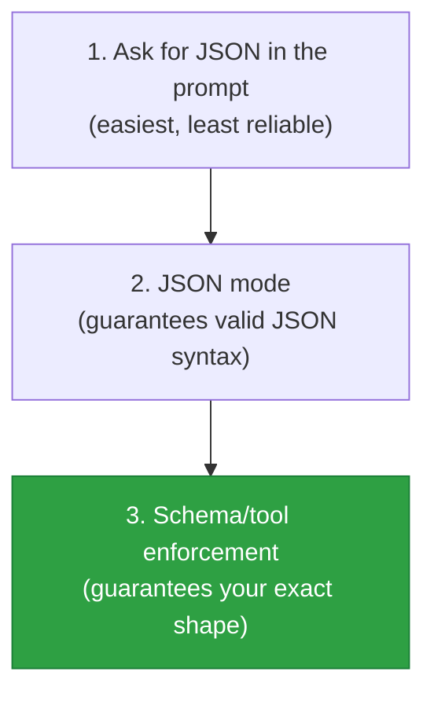

# Structured Outputs

> Free-form text is great for humans and terrible for code. Structured outputs make a model
> return clean, validated JSON your program can rely on.

## Overview

The moment you want to *use* a model's output in software — store it, branch on it, pass it to
another function — you need structure, not prose. Structured outputs constrain the model to
return data in a schema you define (usually JSON), so you can parse and validate it with
confidence. This is the bridge from "chatbot" to "reliable component."

## Learning Objectives

By the end of this page you will be able to:

- Get a model to return valid JSON matching a schema.
- Validate outputs with Pydantic and handle failures.
- Choose between prompt-based JSON, tool/schema-enforced JSON, and JSON mode.
- Avoid the classic pitfalls (markdown fences, extra prose, invalid JSON).

## Theory

### Three levels of reliability



1. **Prompt for JSON** — just ask. Works, but the model may add prose, markdown fences, or drift
   from your shape.
2. **JSON mode** — many providers can guarantee the output is *syntactically valid* JSON.
3. **Schema / tool enforcement** — the strongest: the model is constrained to your exact schema
   (field names, types, required fields). On the Anthropic and OpenAI APIs this is typically done
   via a **tool definition** whose input schema *is* your desired output shape.

Prefer the strongest method your provider supports.

### Define the shape once, in code

Use [Pydantic](https://docs.pydantic.dev/) to define the schema, generate the JSON schema for the
model, *and* validate the response — one source of truth.

```python title="schema.py"
from pydantic import BaseModel, Field

class Ticket(BaseModel):
    category: str = Field(description="One of: billing, bug, feature_request, other")
    urgency: int = Field(ge=1, le=5, description="1 = low, 5 = critical")
    summary: str = Field(description="One-sentence summary of the issue")
```

## Practical Example

The most robust cross-provider pattern: expose a "tool" whose schema is your output type, and
require the model to call it.

```python title="structured_extract.py"
import json
from anthropic import Anthropic
from pydantic import BaseModel, Field, ValidationError

client = Anthropic()

class Ticket(BaseModel):
    category: str = Field(description="billing | bug | feature_request | other")
    urgency: int = Field(ge=1, le=5)
    summary: str

def extract(ticket_text: str) -> Ticket:
    resp = client.messages.create(
        model="claude-sonnet-5",
        max_tokens=400,
        tools=[{
            "name": "record_ticket",
            "description": "Record the structured ticket fields.",
            "input_schema": Ticket.model_json_schema(),   # schema from Pydantic
        }],
        tool_choice={"type": "tool", "name": "record_ticket"},  # force the tool
        messages=[{"role": "user", "content": f"Classify this ticket:\n{ticket_text}"}],
    )
    # The tool call's input is guaranteed to match the schema shape.
    tool_use = next(b for b in resp.content if b.type == "tool_use")
    return Ticket.model_validate(tool_use.input)   # validate to be safe

ticket = extract("Charged twice and the app crashes on upload. Very frustrated!")
print(ticket)   # category='bug' urgency=5 summary='...'
```

If your provider doesn't support schema enforcement, fall back to prompting for JSON and
validating:

```python title="fallback_validation.py"
def parse_or_repair(raw: str) -> Ticket:
    try:
        return Ticket.model_validate_json(raw)
    except ValidationError:
        # Strip markdown fences, retry, or ask the model to fix it.
        cleaned = raw.strip().removeprefix("```json").removesuffix("```").strip()
        return Ticket.model_validate_json(cleaned)
```

!!! tip "Always validate, even with schema enforcement"
    Validation is cheap insurance. It turns a silent bad value into a clear, catchable error at
    the boundary of your system.

## Best Practices

- ✅ Use the strongest enforcement your provider offers (schema/tool > JSON mode > prompt).
- ✅ Define the schema in code (Pydantic) and validate every response.
- ✅ Use `temperature=0` for extraction — you want consistency, not creativity.
- ✅ Add `description`s to fields; they act as inline instructions to the model.
- ✅ Keep schemas as flat and simple as the task allows.

## Common Mistakes

- ❌ Parsing free-form text with regex when you could enforce a schema.
- ❌ Forgetting the model may wrap JSON in ```` ```json ```` fences — strip or enforce.
- ❌ Not validating, then crashing deep in your code on a missing field.
- ❌ Over-nesting schemas — deep structures are harder for models to fill reliably.
- ❌ High temperature during extraction, causing inconsistent fields.

## Exercises

1. Define a Pydantic model for extracting `{name, email, company}` from a signature block and
   enforce it via a tool. Test on messy real signatures.
2. Feed the model input that *can't* satisfy the schema (missing data). How should your code
   handle it? Add a nullable/optional field.
3. Compare prompt-only JSON vs. schema-enforced on 20 inputs. Count parse failures for each.

## References

- [Anthropic — Tool use (for structured output)](https://docs.anthropic.com/en/docs/build-with-claude/tool-use)
- [OpenAI — Structured Outputs](https://platform.openai.com/docs/guides/structured-outputs)
- [Pydantic](https://docs.pydantic.dev/)
- Next in Bee: [Function & Tool Calling](function-calling.md)
