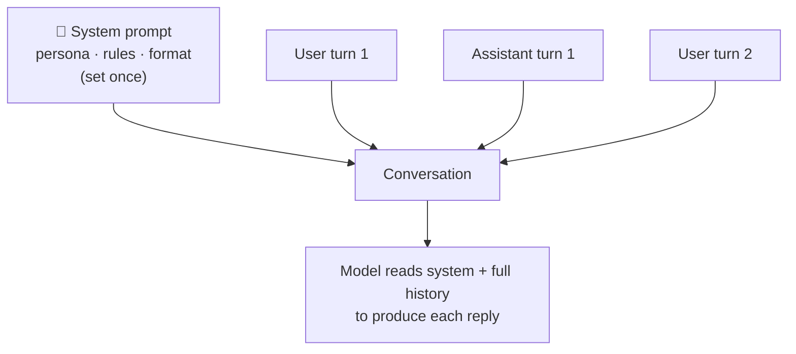

# System Prompts

> The system prompt sets the rules of the game — persona, constraints, and output format — for
> the whole conversation. It's the most durable way to shape a model's behavior.

## Overview

Every message you send has a role. The **system prompt** is special: it's the standing
instruction the model treats as its operating context for the entire conversation, separate from
individual user turns. Get it right and your app behaves consistently; get it wrong and you'll
fight the model with every turn.

## Learning Objectives

By the end of this page you will be able to:

- Distinguish the system prompt from user/assistant messages.
- Write a system prompt that reliably controls persona, scope, and format.
- Understand the security limits of system prompts.

## Theory

### Where it sits



The system prompt applies to *every* turn. User messages come and go; the system prompt persists,
which is why it's the right home for anything that should always be true.

### What belongs in a system prompt

- **Role / persona** — "You are a friendly onboarding assistant for a banking app."
- **Scope & boundaries** — what to help with, what to refuse or redirect.
- **Tone & style** — concise, formal, encouraging.
- **Output format** — "Always respond in Markdown with a short summary first."
- **Key facts & policies** — durable context the model needs every turn.

What does *not* belong: the specific per-turn question (that's a user message), or large volumes
of reference data (use [RAG](../rag/index.md) instead).

### Anatomy of a good system prompt

```text
You are "Nimbus", the support assistant for CloudStore, an e-commerce platform.

## Your role
Help customers with orders, returns, and account issues. Be warm, concise, and accurate.

## Rules
- Only answer questions about CloudStore. For unrelated topics, politely redirect.
- Never invent order details. If you don't have the information, say so and offer to escalate.
- Never ask for or repeat full payment card numbers.

## Format
- Start with a one-sentence direct answer.
- Then, if useful, add up to 3 bullet points.
- End by asking if there's anything else.
```

Notice: clear identity, explicit scope, safety rules, and a concrete format. Structure (headings)
makes it easy for the model to follow — and easy for you to maintain.

## Practical Example

```python title="system_prompt.py"
from anthropic import Anthropic

client = Anthropic()

SYSTEM = """You are a concise SQL tutor.
- Explain concepts with a short example query.
- Use standard SQL unless the user names a dialect.
- If a question isn't about SQL, gently steer back.
- Keep answers under 120 words."""

def ask(question: str) -> str:
    resp = client.messages.create(
        model="claude-sonnet-5",
        max_tokens=300,
        system=SYSTEM,                       # <-- the system prompt
        messages=[{"role": "user", "content": question}],
    )
    return resp.content[0].text

print(ask("How do I get the second-highest salary?"))
```

Because the persona and format live in `SYSTEM`, every question gets consistent, on-brand
answers — you don't repeat the rules each turn.

## Security: the limits of system prompts

> [!WARNING]
> A system prompt is **guidance, not a security boundary.** Users can attempt
> [prompt injection](../security/index.md) to override it ("ignore your instructions…"). Treat
> the system prompt as shaping *normal* behavior, and enforce real safety with input/output
> [guardrails](../security/index.md), least-privilege [tools](function-calling.md), and
> validation — not with the system prompt alone.

Also: don't put secrets (API keys, internal URLs) in the system prompt assuming users can't see
them. Assume anything in the prompt could be surfaced.

## Best Practices

- ✅ Keep it structured (headings/bullets) and as short as it can be while complete.
- ✅ State scope and refusal behavior explicitly.
- ✅ Specify the output format you'll parse or display.
- ✅ Version your system prompts and [evaluate](../evaluation/index.md) changes.

## Common Mistakes

- ❌ Stuffing per-question data into the system prompt (use user messages / RAG).
- ❌ Relying on it as a security control against injection.
- ❌ Making it so long and contradictory the model can't follow it.
- ❌ Putting secrets in it.

## Exercises

1. Write a system prompt for a cooking assistant that only discusses recipes and refuses other
   topics. Test whether it stays in scope.
2. Add a strict output format ("always reply as JSON with `answer` and `confidence`"). Does the
   model comply every time? (This motivates [structured outputs](structured-outputs.md).)
3. Try to make the model break its own rules with a user message. What did it take? What does
   that tell you about relying on system prompts for safety?

## References

- [Anthropic — System prompts](https://docs.anthropic.com/en/docs/build-with-claude/prompt-engineering/system-prompts)
- [OpenAI — Message roles & instructions](https://platform.openai.com/docs/guides/text-generation)
- Bee: [Prompt Engineering](prompt-engineering.md) · [Security](../security/index.md)
