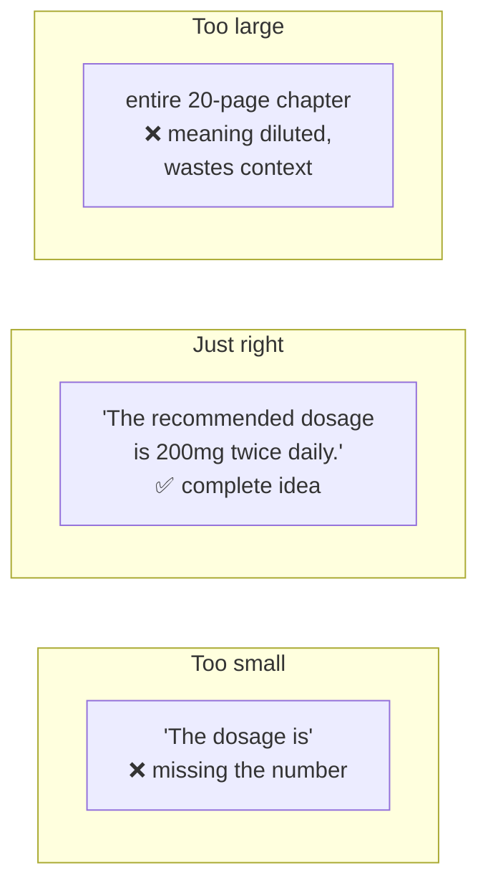

# Chunking

> How you split documents into pieces decides what your system can retrieve — and it's the single
> biggest lever on RAG quality. Get chunking right and everything downstream improves.

## Overview

You can't embed a 100-page document as one vector — you'd lose all specificity, and it wouldn't
fit sensibly in a prompt. So you split documents into **chunks**, embed each, and retrieve the
few most relevant ones per query. The trade-off is fundamental: **chunks too big** dilute meaning
and waste context; **chunks too small** lose the surrounding information needed to make sense.
This page shows how to strike the balance.

## Learning Objectives

By the end of this page you will be able to:

- Explain why chunk size and overlap matter.
- Choose a chunking strategy for your document type.
- Implement fixed-size, recursive, and structure-aware chunking.
- Attach metadata so retrieved chunks stay traceable and useful.

## Theory

### The core trade-off



- **Too small:** a chunk might contain a fact but not its subject, or split a sentence mid-idea.
- **Too large:** one chunk covers many topics, so its embedding is a muddy average and retrieval
  gets imprecise. It also eats context-window budget.

A common starting point: **~200–500 tokens per chunk** with **~10–20% overlap**. But the *right*
answer depends on your content — tune it with [evaluation](evaluation.md).

### Overlap: don't cut ideas in half

**Overlap** repeats a bit of text between adjacent chunks so an idea split across a boundary
still appears intact in at least one chunk.

```text
Chunk 1: "...patients over 65. The recommended dosage is 200mg"
Chunk 2: "The recommended dosage is 200mg twice daily. Side effects..."
                      └── overlap keeps the dosage sentence whole ──┘
```

### Chunking strategies, from simple to smart

| Strategy | How it works | Best for |
|----------|--------------|----------|
| **Fixed-size** | Split every N tokens/characters | Quick baseline; uniform text |
| **Recursive** | Split on natural boundaries (¶, sentence) up to a size | General prose (good default) |
| **Structure-aware** | Split by headings/sections (Markdown, HTML) | Docs with clear structure |
| **Semantic** | Split where the topic shifts (embedding-based) | Dense, varied documents |
| **Per-format** | Rows for tables, functions for code | Structured/code content |

**Recommendation:** start with **recursive** chunking that respects paragraph and sentence
boundaries. Move to structure-aware or semantic only if evaluation shows you need it.

## Practical Example

A dependency-free recursive splitter that respects natural boundaries, plus metadata:

```python title="chunking.py"
def recursive_chunk(text: str, max_chars: int = 1200, overlap: int = 150) -> list[str]:
    """Split on paragraphs, then sentences, keeping chunks under max_chars with overlap."""
    paragraphs = [p.strip() for p in text.split("\n\n") if p.strip()]
    chunks, current = [], ""

    for para in paragraphs:
        if len(current) + len(para) + 2 <= max_chars:
            current = f"{current}\n\n{para}".strip()
        else:
            if current:
                chunks.append(current)
            # Carry the tail of the previous chunk forward as overlap.
            tail = current[-overlap:] if current else ""
            current = f"{tail}\n\n{para}".strip() if tail else para
    if current:
        chunks.append(current)
    return chunks


def chunk_document(doc_id: str, source: str, text: str) -> list[dict]:
    """Attach metadata so every chunk is traceable back to its source."""
    return [
        {
            "id": f"{doc_id}::chunk-{i}",
            "text": chunk,
            "metadata": {"doc_id": doc_id, "source": source, "chunk_index": i},
        }
        for i, chunk in enumerate(recursive_chunk(text))
    ]
```

!!! tip "Production libraries"
    In real projects, libraries like LangChain's `RecursiveCharacterTextSplitter` or LlamaIndex's
    node parsers handle edge cases (code, markdown, token-accurate sizing). Understand the
    principles here, then use a battle-tested splitter.

### Metadata is not optional

Store metadata with every chunk: `source`, `doc_id`, `chunk_index`, and anything you'll filter or
cite by (author, date, section, permissions). It lets you:

- **Cite** answers back to a source (essential for trust).
- **Filter** retrieval (e.g. only this user's documents — also a [security](../security/index.md)
  control).
- **Debug** which chunk produced a bad answer.

## Best Practices

- ✅ Start with recursive chunking, ~200–500 tokens, ~10–20% overlap; then tune with evals.
- ✅ Respect natural boundaries (headings, paragraphs, sentences) — don't cut mid-idea.
- ✅ Attach rich metadata to every chunk.
- ✅ Chunk by *token* count when you can, since that's what limits and cost use.
- ✅ Handle special content (tables, code) with format-aware splitting.

## Common Mistakes

- ❌ One-size-fits-all chunking across wildly different document types.
- ❌ Zero overlap, so facts get split across boundaries and never retrieved whole.
- ❌ Giant chunks that dilute meaning and blow the context budget.
- ❌ Dropping metadata, making citations and debugging impossible.
- ❌ Never measuring — chunking is empirical; tune it against [evals](evaluation.md).

## Exercises

1. Chunk the same document with 200-, 500-, and 1,500-token chunks. Retrieve for a specific
   question and compare which returns the precise answer.
2. Add 0% vs. 20% overlap and find a query whose answer sits on a chunk boundary. Does overlap
   fix it?
3. Write a structure-aware splitter for Markdown that starts a new chunk at each `##` heading and
   keeps the heading with its section.

## References

- [Pinecone — Chunking strategies](https://www.pinecone.io/learn/chunking-strategies/)
- [LangChain — Text splitters](https://python.langchain.com/docs/concepts/text_splitters/)
- Bee: [Embeddings](../concepts/embeddings.md) · [Vector Databases](vector-databases.md) · [Evaluating RAG](evaluation.md)
