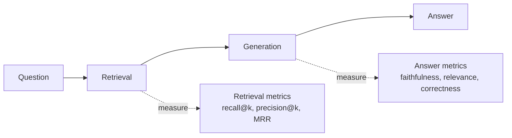

# Evaluating RAG

> A RAG system has two things that can fail — retrieval and generation — and you must measure both
> separately to know what to fix. This is how you improve RAG with confidence instead of guesswork.

## Overview

"The answer was wrong" isn't actionable. Was the *right chunk* even retrieved? If not, fix
[chunking](chunking.md) or [retrieval](hybrid-search-reranking.md). If it *was* retrieved but the
answer is still wrong, fix the prompt or model. **Evaluating retrieval and generation separately**
turns a vague complaint into a specific fix. This page gives you the metrics and a runnable
harness.

## Learning Objectives

By the end of this page you will be able to:

- Separate and measure retrieval quality vs. answer quality.
- Compute retrieval metrics (recall@k, precision@k, MRR).
- Measure answer faithfulness (groundedness) and relevance.
- Build a small evaluation harness you can run on every change.

## Theory

### Two stages, two failure modes



If retrieval fails, generation can't succeed — garbage in, garbage out. So **always check
retrieval first.**

### Retrieval metrics

You need a small labeled set: for each question, which chunks are actually relevant ("ground
truth").

| Metric | Question it answers |
|--------|---------------------|
| **Recall@k** | Of all relevant chunks, how many are in the top _k_? (Did we *find* the info?) |
| **Precision@k** | Of the top _k_, how many are relevant? (How much *noise*?) |
| **MRR** (Mean Reciprocal Rank) | How high up is the *first* relevant chunk? |

For RAG, **recall@k is usually the priority** — if the answer isn't retrieved, nothing else
matters.

### Answer metrics

| Metric | Meaning | How to measure |
|--------|---------|----------------|
| **Faithfulness / groundedness** | Is the answer supported by the retrieved chunks (no hallucination)? | LLM-as-judge |
| **Answer relevance** | Does it actually address the question? | LLM-as-judge |
| **Correctness** | Does it match the known-correct answer? | Compare to reference |

Faithfulness is RAG's most important quality signal: a fluent answer that isn't grounded in your
sources is exactly the failure RAG is supposed to prevent.

## Practical Example

### Retrieval metrics from a labeled set

```python title="retrieval_eval.py"
def recall_at_k(retrieved: list[str], relevant: set[str], k: int) -> float:
    top_k = set(retrieved[:k])
    return len(top_k & relevant) / len(relevant) if relevant else 0.0

def precision_at_k(retrieved: list[str], relevant: set[str], k: int) -> float:
    top_k = retrieved[:k]
    hits = sum(1 for d in top_k if d in relevant)
    return hits / k

def mrr(retrieved: list[str], relevant: set[str]) -> float:
    for rank, doc in enumerate(retrieved, start=1):
        if doc in relevant:
            return 1.0 / rank
    return 0.0

# One eval case: the question, what your system retrieved, and the true relevant chunks.
retrieved = ["c3", "c1", "c9", "c2"]
relevant  = {"c1", "c2"}
print(f"recall@3    = {recall_at_k(retrieved, relevant, 3):.2f}")   # 0.50
print(f"precision@3 = {precision_at_k(retrieved, relevant, 3):.2f}") # 0.33
print(f"MRR         = {mrr(retrieved, relevant):.2f}")               # 0.50
```

### Faithfulness with an LLM judge

```python title="faithfulness_eval.py"
from anthropic import Anthropic

client = Anthropic()

JUDGE = """You are evaluating whether an ANSWER is fully supported by the CONTEXT.
Reply with only a JSON object: {{"faithful": true|false, "reason": "..."}}.
"faithful" is true only if every claim in the answer is supported by the context.

CONTEXT:
{context}

ANSWER:
{answer}"""

def judge_faithfulness(context: str, answer: str) -> dict:
    resp = client.messages.create(
        model="claude-sonnet-5", max_tokens=200, temperature=0,
        messages=[{"role": "user", "content": JUDGE.format(context=context, answer=answer)}],
    )
    import json
    return json.loads(resp.content[0].text)

print(judge_faithfulness(
    context="The refund window is 30 days.",
    answer="You can get a refund within 30 days of purchase.",
))  # {"faithful": true, ...}
```

!!! warning "Validate your judge"
    An LLM judge is itself an LLM — it can be wrong or biased. Before trusting it, check its
    verdicts against human labels on a sample. See [Evaluation](../evaluation/index.md).

### A minimal harness

```python title="harness.py"
# eval_set: list of {question, relevant_ids, reference_answer}
def evaluate(rag_system, eval_set, k=5):
    recalls, faithfuls = [], []
    for case in eval_set:
        retrieved_ids, context, answer = rag_system.answer(case["question"])
        recalls.append(recall_at_k(retrieved_ids, set(case["relevant_ids"]), k))
        faithfuls.append(judge_faithfulness(context, answer)["faithful"])
    return {
        "recall@k": sum(recalls) / len(recalls),
        "faithfulness": sum(faithfuls) / len(faithfuls),
    }
```

Run this on every change to chunking, retrieval, or prompts. If `recall@k` drops, it's a
retrieval regression; if `faithfulness` drops with recall steady, it's a generation regression.

## Best Practices

- ✅ Build a labeled eval set from *real* questions, including hard and edge cases.
- ✅ Diagnose retrieval before generation — fix the earlier stage first.
- ✅ Track metrics over time; treat regressions like failing tests.
- ✅ Prioritize recall@k for retrieval and faithfulness for answers.
- ✅ Validate LLM judges against human labels.

## Common Mistakes

- ❌ Only reading final answers — you can't tell *which* stage failed.
- ❌ Tuning chunking/retrieval by vibes instead of recall@k.
- ❌ Trusting an unvalidated LLM judge.
- ❌ A tiny, unrepresentative eval set that you overfit to.
- ❌ Never re-running evals after "small" prompt tweaks.

## Exercises

1. Label 10 questions with their relevant chunk IDs. Compute recall@3 and recall@10 for your
   system. Where does it lose information?
2. Find an answer that's fluent but *not* grounded in the retrieved context. Confirm your
   faithfulness judge catches it.
3. Change chunk size and re-run the harness. Which metric moved, and what does that tell you?

## References

- [Ragas — RAG evaluation framework](https://docs.ragas.io/)
- [Anthropic — Building evals](https://docs.anthropic.com/en/docs/test-and-evaluate)
- Bee: [Evaluation](../evaluation/index.md) · [Chunking](chunking.md) · [Hybrid Search & Reranking](hybrid-search-reranking.md)
