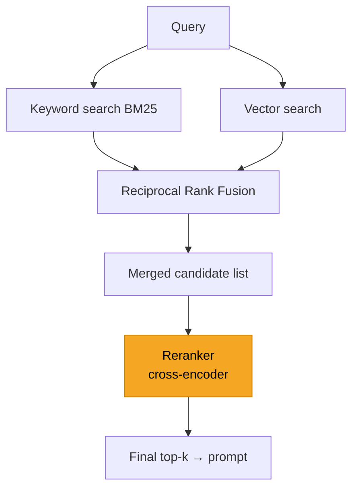

# Hybrid Search & Reranking

> Pure vector search misses exact matches; pure keyword search misses meaning. Combine them
> (hybrid search) and add a reranking pass, and retrieval quality jumps.

## Overview

[Vector search](vector-databases.md) is great at *meaning* ("login trouble" ≈ "can't sign in")
but can miss **exact terms** — product codes, error numbers, names, acronyms. Classic **keyword
search** (BM25) nails exact terms but misses paraphrases. **Hybrid search** runs both and merges
the results. A **reranker** then does a slower, more accurate relevance pass over the top
candidates. Together they meaningfully raise the odds the right chunk reaches the model.

## Learning Objectives

By the end of this page you will be able to:

- Explain when keyword search beats vector search and vice versa.
- Combine results with Reciprocal Rank Fusion (RRF).
- Add a cross-encoder reranker for precision.
- Sequence retrieval → fusion → rerank into a strong pipeline.

## Theory

### Two kinds of search, two blind spots

| | **Keyword (BM25)** | **Vector (semantic)** |
|---|---|---|
| Finds | Exact terms, rare tokens, codes | Meaning, paraphrases, synonyms |
| Misses | Synonyms, rephrasing | Exact IDs, unusual terms |
| Example win | "ERR_4021", "Model X-500" | "my order won't arrive" → "shipping delay" |

Because their weaknesses are complementary, combining them beats either alone.

### Hybrid search: fuse the two rankings

Run both searches, then merge with **Reciprocal Rank Fusion (RRF)** — a simple, robust method
that combines rankings without needing the scores to be on the same scale:

$$\text{RRF score}(d) = \sum_{r \in \text{rankers}} \frac{1}{k + \text{rank}_r(d)}$$

Each document's score is the sum, across rankers, of 1 / (k + its rank). Documents ranked highly
by *either* method rise to the top; documents ranked highly by *both* rise fastest.



### Reranking: a second, sharper opinion

Retrieval optimizes for *speed* over millions of items, so it's approximate. A **reranker** takes
the top ~20–100 candidates and scores each one's relevance to the query much more accurately.

The key difference:

- **Bi-encoder (retrieval):** embeds query and documents *separately*, then compares — fast,
  scalable, less precise.
- **Cross-encoder (reranker):** feeds the query *and* a candidate *together* into a model that
  outputs a relevance score — slower, but far more precise because it can compare them directly.

You retrieve broadly and cheaply, then rerank narrowly and precisely — the best of both.

## Practical Example

### Reciprocal Rank Fusion

```python title="rrf.py"
def reciprocal_rank_fusion(rankings: list[list[str]], k: int = 60) -> list[str]:
    """Merge multiple ranked lists of doc IDs into one. `rankings` = [bm25_ids, vector_ids]."""
    scores: dict[str, float] = {}
    for ranking in rankings:
        for rank, doc_id in enumerate(ranking):
            scores[doc_id] = scores.get(doc_id, 0.0) + 1.0 / (k + rank)
    return sorted(scores, key=scores.get, reverse=True)

bm25_results   = ["docA", "docC", "docE"]
vector_results = ["docC", "docB", "docA"]
print(reciprocal_rank_fusion([bm25_results, vector_results]))
# docC ranks first — it appears high in both lists.
```

### Cross-encoder reranking

```python title="rerank.py"
from sentence_transformers import CrossEncoder

# A small cross-encoder that scores (query, passage) relevance.
reranker = CrossEncoder("cross-encoder/ms-marco-MiniLM-L-6-v2")

def rerank(query: str, candidates: list[str], top_n: int = 3) -> list[tuple[float, str]]:
    pairs = [(query, c) for c in candidates]
    scores = reranker.predict(pairs)                       # higher = more relevant
    ranked = sorted(zip(scores, candidates), reverse=True)
    return ranked[:top_n]

query = "how do I recover my account?"
candidates = [
    "Reset your password from account settings.",
    "Our refund window is 30 days.",
    "Recovering access to a locked account: steps.",
]
for score, text in rerank(query, candidates):
    print(f"{score:.2f}  {text}")
```

!!! tip "Managed rerankers"
    Providers like Cohere and Voyage offer hosted reranking APIs — one call, no model to run.
    Great when you don't want to host a cross-encoder.

## Best Practices

- ✅ Add hybrid search when queries contain exact terms (IDs, names, codes) *and* natural
  language.
- ✅ Retrieve a generous candidate set (e.g. top 50) *then* rerank down to the few you send.
- ✅ Use RRF to fuse — it's simple and doesn't require score calibration.
- ✅ Measure the lift with [evaluation](evaluation.md); complexity should earn its place.

## Common Mistakes

- ❌ Adding reranking/hybrid before measuring — you may be optimizing a non-problem.
- ❌ Reranking too many candidates — cross-encoders are slow; cap the input set.
- ❌ Trying to average raw scores from different systems instead of fusing ranks (RRF).
- ❌ Forgetting rerankers add latency — budget for it in user-facing apps.

## Exercises

1. Build a query with an exact product code and a paraphrase. Show a case where BM25 wins and one
   where vector search wins; confirm hybrid gets both.
2. Retrieve top-20 with vectors, then rerank to top-3. How often does reranking promote a better
   chunk into the top-3?
3. Measure the added latency of reranking. Is it acceptable for your use case?

## References

- [Cohere — Reranking](https://docs.cohere.com/docs/reranking)
- [Reciprocal Rank Fusion paper](https://plg.uwaterloo.ca/~gvcormac/cormacksigir09-rrf.pdf)
- [BM25 explained](https://www.pinecone.io/learn/hybrid-search-intro/)
- Next in Bee: [Evaluating RAG](evaluation.md)
