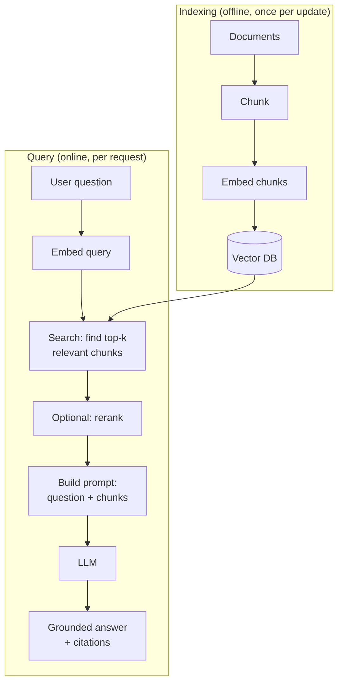

# RAG — Retrieval-Augmented Generation

> Give a model access to *your* knowledge — documents, wikis, tickets — so it answers from facts
> instead of guessing. RAG is the most common way to build accurate, up-to-date AI features.

## Overview

LLMs only know what was in their training data, up to a cutoff date, and they don't know *your*
private documents at all. **Retrieval-Augmented Generation (RAG)** solves both: at query time you
*retrieve* the most relevant pieces of your content and put them in the prompt, so the model
*generates* an answer grounded in those facts — with citations you can verify.

## Learning Objectives

By the end of this section you will be able to:

- Explain the RAG pipeline end-to-end and when to use it.
- Chunk documents effectively (the biggest quality lever).
- Store and search embeddings with a vector database.
- Improve retrieval with hybrid search and reranking.
- Evaluate a RAG system so you can improve it with confidence.

## The RAG pipeline

RAG has two phases: an offline **indexing** phase and an online **query** phase.

## What you'll learn

- :material-scissors-cutting:{ .lg .middle } **[Chunking](chunking.md)**

    ---

    How you split documents determines what can be retrieved. The highest-leverage decision in
    RAG.

- :material-database:{ .lg .middle } **[Vector Databases](vector-databases.md)**

    ---

    Store embeddings and find nearest neighbors fast, at scale.

- :material-magnify-plus:{ .lg .middle } **[Hybrid Search & Reranking](hybrid-search-reranking.md)**

    ---

    Combine keyword + semantic search, then reorder for precision.

- :material-check-decagram:{ .lg .middle } **[Evaluating RAG](evaluation.md)**

    ---

    Measure retrieval and answer quality so you can actually improve.

## When to use RAG (and when not to)

| Use RAG when… | Consider alternatives when… |
|---|---|
| Answers must come from your private/changing data | The knowledge is static and small → just put it in the prompt |
| You need citations and verifiability | You need new *skills/behavior* → [fine-tuning](../concepts/how-llms-work.md) |
| The knowledge base is large | The task needs *actions* → [tools/agents](../agents/index.md) |

!!! tip "RAG is a retrieval problem first"
    Most "the LLM gave a bad answer" problems in RAG are actually *retrieval* problems — the
    right information never made it into the prompt. Debug retrieval before blaming the model.

## Prerequisites

This section assumes you understand [Embeddings](../concepts/embeddings.md). If "cosine
similarity" is unfamiliar, read that first.
