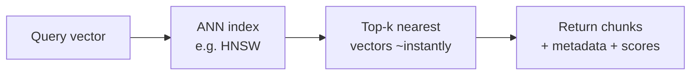

# Vector Databases

> A vector database stores embeddings and finds the nearest ones to a query — fast, even across
> millions of vectors. It's the retrieval engine at the heart of RAG.

## Overview

Once your documents are [chunked](chunking.md) and [embedded](../concepts/embeddings.md), you need
somewhere to put those vectors and a way to find the most similar ones to a query vector. Doing
this by brute force (compare against every vector) is fine for a few thousand items and hopeless
for millions. A **vector database** solves this with specialized indexes for **approximate
nearest neighbor (ANN)** search.

## Learning Objectives

By the end of this page you will be able to:

- Explain what a vector database does and why brute force doesn't scale.
- Understand ANN indexes (like HNSW) at an intuitive level.
- Choose a vector store for your needs.
- Store vectors with metadata and query them with filters.

## Theory

### The problem: nearest-neighbor search at scale

Retrieval = "find the _k_ vectors closest to my query vector." Exactly comparing against every
vector (exact k-NN) is _O(n)_ per query — too slow at scale. **ANN** trades a tiny bit of
accuracy for enormous speed by cleverly organizing vectors so you only examine a small fraction.



### HNSW in one paragraph

The most popular index, **HNSW** (Hierarchical Navigable Small World), builds a layered graph of
vectors. Search starts at a sparse top layer to jump close to the target region, then descends
into denser layers to refine — like zooming in on a map. You get near-instant search with high
recall, at the cost of memory and build time. You don't implement it; you just pick it and tune a
couple of knobs.

### Similarity metrics

The database compares vectors using a metric — match it to how your embedding model was trained
(usually cosine or dot product):

| Metric | Measures | Common with |
|--------|----------|-------------|
| **Cosine** | Angle (direction) | Most text embeddings |
| **Dot product** | Direction + magnitude | Some models (normalized vectors) |
| **Euclidean (L2)** | Straight-line distance | Some image/embedding models |

### Choosing a vector store

| Option | Type | Good for |
|--------|------|----------|
| **Chroma** | Embedded/local | Prototyping, small apps, learning |
| **FAISS** | Library | In-process, high control, no server |
| **pgvector** | Postgres extension | You already use Postgres; SQL + vectors together |
| **Qdrant / Weaviate / Milvus** | Dedicated server | Scale, filtering, hybrid search |
| **Pinecone** | Managed cloud | No-ops, scale without running infra |

**Recommendation:** prototype with **Chroma** or **pgvector** (if you have Postgres). Reach for a
dedicated/managed store when you need scale, advanced filtering, or hybrid search.

## Practical Example

A complete mini-pipeline with Chroma — embed, store with metadata, and query:

```python title="vector_store.py"
import chromadb

client = chromadb.Client()                 # in-memory; use PersistentClient to save to disk
collection = client.create_collection(
    name="docs",
    metadata={"hnsw:space": "cosine"},     # choose the similarity metric
)

# Store chunks (Chroma can embed for you, or pass your own embeddings).
collection.add(
    ids=["doc1::chunk-0", "doc1::chunk-1", "doc2::chunk-0"],
    documents=[
        "Reset your password from the account settings page.",
        "Our refund window is 30 days from purchase.",
        "Two-factor authentication adds a login code step.",
    ],
    metadatas=[
        {"source": "help/account.md", "doc_id": "doc1"},
        {"source": "help/refunds.md", "doc_id": "doc1"},
        {"source": "help/security.md", "doc_id": "doc2"},
    ],
)

# Query: find the 2 most relevant chunks, optionally filtered by metadata.
results = collection.query(
    query_texts=["how do I recover my login?"],
    n_results=2,
    where={"doc_id": "doc1"},              # metadata filter (e.g. scope to a source/user)
)

for doc, meta, dist in zip(
    results["documents"][0], results["metadatas"][0], results["distances"][0]
):
    print(f"{dist:.3f}  [{meta['source']}]  {doc}")
```

!!! tip "Metadata filtering is a superpower"
    Filtering by metadata (user id, tenant, date, permissions) *before* or *during* search keeps
    results relevant **and** enforces access control — a user should only ever retrieve their own
    documents. See [Security](../security/index.md).

## Best Practices

- ✅ Match the DB's similarity metric to your embedding model.
- ✅ Store rich metadata and use filters for relevance and access control.
- ✅ Persist to disk (or use a managed store) — don't lose your index on restart.
- ✅ Re-embed and re-index when you change embedding models (vectors aren't cross-compatible).
- ✅ Start simple; scale the store only when data volume or features demand it.

## Common Mistakes

- ❌ Brute-forcing similarity in application code at scale instead of using an ANN index.
- ❌ Mixing embeddings from different models/versions in one collection.
- ❌ Ignoring metadata, then being unable to cite, filter, or enforce permissions.
- ❌ Assuming ANN is exact — it's approximate; tune recall vs. speed if precision matters.
- ❌ Forgetting to re-index after changing chunking or embeddings.

## Exercises

1. Load 50 chunks into Chroma and compare query results with `n_results` of 1, 3, and 10. How
   does answer quality change?
2. Add a `date` field to metadata and filter retrieval to a date range.
3. Swap the metric from cosine to L2 on the same data. Do the rankings change? Why?

## References

- [Chroma docs](https://docs.trychroma.com/)
- [pgvector](https://github.com/pgvector/pgvector)
- [HNSW paper](https://arxiv.org/abs/1603.09320) — the index behind most vector DBs
- Next in Bee: [Hybrid Search & Reranking](hybrid-search-reranking.md)
