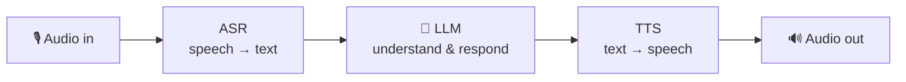

# Speech AI

> Turning speech into text (ASR), text into speech (TTS), and building voice-driven AI
> applications.

## Overview

Voice interfaces are built from a pipeline of three stages, often wrapped around an LLM:



- **ASR (Automatic Speech Recognition)** — transcribe audio to text. [Whisper](https://github.com/openai/whisper)
  is the open standard; hosted APIs are often faster and simpler.
- **TTS (Text-to-Speech)** — synthesize natural-sounding speech from text.
- **Diarization** — figure out *who* spoke *when* (speaker labels).

## Learning Objectives

By the end of this section you will be able to:

- Transcribe audio with an ASR model and handle timestamps.
- Choose between local (Whisper) and hosted transcription.
- Build a simple voice-assistant loop (ASR → LLM → TTS).
- Understand latency budgets for real-time voice.

## Quick taste: transcribe audio

```python title="transcribe.py"
# Using the open-source Whisper model locally (CPU works, GPU is faster).
import whisper

model = whisper.load_model("base")     # tiny/base/small/medium/large
result = model.transcribe("meeting.mp3")
print(result["text"])
```

## Best Practices

- ✅ Match model size to your latency and accuracy needs — bigger isn't always worth it.
- ✅ Stream audio for real-time UX; batch for offline transcription.
- ✅ Clean audio (noise reduction, correct sample rate) before ASR.

## Common Mistakes

- ❌ Ignoring latency — a 3-second round trip feels broken in a voice conversation.
- ❌ Sending raw, noisy audio and blaming the model for poor transcripts.
- ❌ Forgetting to handle silence and interruptions in live voice apps.

## 🐝 Help build this section

Claim a topic by [opening an issue](https://github.com/bee-ai-labs/bee/issues/new/choose):

- ✅ **[Speech-to-Text (ASR)](speech-to-text.md)** — Whisper, timestamps, model sizing 🟡
- `[WANTED]` **Real-time voice pipelines** — streaming, VAD, barge-in 🔴
- ✅ **[Text-to-Speech (TTS)](text-to-speech.md)** — local vs hosted, streaming, SSML 🟡
- `[WANTED]` **Speaker diarization** — who said what 🔴
- `[WANTED]` **Meeting assistant example** — record → transcribe → summarize 🟡

## References

- [OpenAI Whisper](https://github.com/openai/whisper)
- [Hugging Face — Audio course](https://huggingface.co/learn/audio-course)
