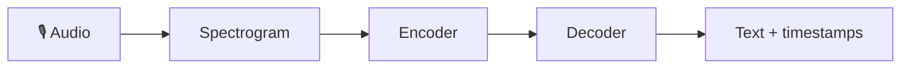

# Speech-to-Text (ASR)

> Turning audio into text with automatic speech recognition — the front door of every voice
> application, from transcription to voice assistants.

## Overview

**Automatic Speech Recognition (ASR)** converts spoken audio into written text. Modern ASR is
dominated by transformer models — most famously OpenAI's open-source **Whisper** — that transcribe
many languages robustly, even with accents and background noise. This page shows how to transcribe
audio, get timestamps, choose a model size, and avoid the pitfalls that make transcripts worse
than they should be.

## Learning Objectives

By the end of this page you will be able to:

- Transcribe an audio file locally with Whisper.
- Get word/segment timestamps for captions and search.
- Trade off model size vs. speed vs. accuracy.
- Decide between local and hosted ASR.

## Theory

### How modern ASR works (briefly)

Audio is first turned into a **spectrogram** (a picture of frequencies over time), which a
transformer encoder consumes; a decoder then generates text tokens — the same encoder-decoder idea
from [The Transformer](../concepts/transformers.md), applied to sound. Because it's trained on huge
multilingual data, one model handles many languages and can even translate speech to English.



### Model size: the core trade-off

Whisper (and most ASR) ships in sizes. Bigger = more accurate but slower and heavier:

| Size | Relative speed | Use when |
|------|----------------|----------|
| `tiny` / `base` | Fastest | Quick drafts, real-time on CPU, clean audio |
| `small` / `medium` | Balanced | Most production transcription |
| `large` | Slowest, best | Hard audio: accents, noise, domain terms |

> [!TIP]
> Don't default to `large`. Test a smaller model on *your* audio first — it's often accurate
> enough at a fraction of the cost and latency.

### Local vs. hosted

| | **Local (Whisper)** | **Hosted API** |
|---|---|---|
| Cost | Free compute (your hardware) | Per minute of audio |
| Privacy | Audio never leaves your machine | Audio sent to provider |
| Setup | Install + model download | One API call |
| Best for | Privacy-sensitive, high volume | Fast start, no infra |

## Practical Example

### Transcribe locally with Whisper

```python title="transcribe.py"
import whisper  # pip install -U openai-whisper  (needs ffmpeg installed)

model = whisper.load_model("base")          # tiny/base/small/medium/large
result = model.transcribe("meeting.mp3")

print(result["text"])                        # full transcript
```

### Get timestamped segments (for captions or search)

```python title="segments.py"
result = model.transcribe("interview.wav")
for seg in result["segments"]:
    start, end, text = seg["start"], seg["end"], seg["text"]
    print(f"[{start:6.1f}s → {end:6.1f}s] {text.strip()}")
# [   0.0s →    4.2s] Welcome to the show.
# [   4.2s →    9.8s] Today we're talking about speech recognition.
```

Timestamps let you build subtitles (SRT/VTT), jump-to-quote search, and align a transcript with
the audio for a [meeting assistant](index.md).

!!! tip "Clean audio beats a bigger model"
    Correct sample rate, mono channel, and light noise reduction improve accuracy more than
    jumping up a model size. Garbage audio in → garbage transcript out.

## Best Practices

- ✅ Match model size to your accuracy/latency budget — measure on real audio.
- ✅ Pre-process: correct sample rate, convert to mono, reduce obvious noise.
- ✅ Use timestamps for captions and to align text with audio.
- ✅ For real-time, stream audio in chunks and use a small model.
- ✅ Post-process domain terms (names, jargon) with a correction dictionary if needed.

## Common Mistakes

- ❌ Reaching for `large` when `small` would do — wasted time and compute.
- ❌ Feeding noisy, wrong-sample-rate audio and blaming the model.
- ❌ Ignoring latency in live voice apps — a long transcription lag feels broken.
- ❌ Assuming perfect accuracy — always allow for transcription errors downstream.

## Exercises

1. Transcribe the same clip with `tiny`, `base`, and `small`. Compare accuracy and time. Which is
   "good enough" for your use case?
2. Generate an SRT subtitle file from the segment timestamps.
3. Feed a noisy recording, then a cleaned version (mono, denoised). Measure the difference.

## References

- [OpenAI Whisper](https://github.com/openai/whisper)
- [Whisper paper](https://arxiv.org/abs/2212.04356)
- Bee: [Speech overview](index.md) · [The Transformer](../concepts/transformers.md)
