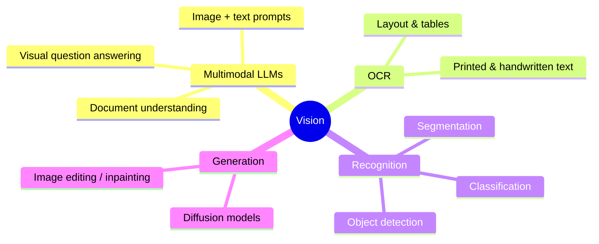

# Computer Vision & Multimodal

> How modern AI sees — from image understanding with multimodal LLMs to OCR, detection, and image
> generation.

## Overview

"Vision AI" today spans two worlds that are rapidly merging:

1. **Multimodal LLMs** — models that accept images *and* text in the same prompt, so you can ask
   questions about a screenshot, a chart, or a photo in natural language.
2. **Specialized vision models** — OCR, object detection, segmentation, and image generation
   (diffusion) that do one thing extremely well.

Most applications combine them: a multimodal LLM for reasoning, a specialized model for the
heavy lifting.

## What this section covers



## Learning Objectives

By the end of this section you will be able to:

- Send an image to a multimodal LLM and reason about the response.
- Choose between a multimodal LLM and a specialized model for a task.
- Build a document-understanding pipeline (OCR → structure → LLM).
- Understand how diffusion models generate images at a high level.

## Quick taste: ask an LLM about an image

```python title="describe_image.py"
import base64
from anthropic import Anthropic

client = Anthropic()

with open("chart.png", "rb") as f:
    image_data = base64.standard_b64encode(f.read()).decode("utf-8")

response = client.messages.create(
    model="claude-sonnet-5",
    max_tokens=300,
    messages=[{
        "role": "user",
        "content": [
            {"type": "image", "source": {
                "type": "base64", "media_type": "image/png", "data": image_data}},
            {"type": "text", "text": "What trend does this chart show? Be specific."},
        ],
    }],
)
print(response.content[0].text)
```

## Best Practices

- ✅ Downscale images to the model's recommended size — huge images cost more tokens for no gain.
- ✅ For documents, combine OCR + layout detection with an LLM rather than relying on one model.
- ✅ Be explicit in prompts about *what* to extract ("return the total as a number").

## Common Mistakes

- ❌ Sending full-resolution images and paying for tokens you don't need.
- ❌ Trusting OCR blindly on low-quality scans — validate critical fields.
- ❌ Using image generation output commercially without checking the model's license.

## 🐝 Help build this section

This section is early. We'd love contributions on the topics below — claim one by
[opening an issue](https://github.com/bee-ai-labs/bee/issues/new/choose):

- `[WANTED]` **Multimodal LLMs deep-dive** — how image tokens work, cost, limits 🟡
- `[WANTED]` **OCR pipelines** — Tesseract vs. cloud vs. multimodal LLMs 🟡
- `[WANTED]` **Object detection with YOLO** — a runnable example 🟡
- `[WANTED]` **Diffusion models explained** — how image generation works 🔴
- `[WANTED]` **Document QA example** — invoices/receipts to structured data 🟡

See [CONTRIBUTING.md](https://github.com/bee-ai-labs/bee/blob/main/CONTRIBUTING.md) and the content
contract.

## References

- [Anthropic — Vision](https://docs.anthropic.com/en/docs/build-with-claude/vision)
- [Hugging Face — Computer Vision course](https://huggingface.co/learn/computer-vision-course)
- [CLIP paper](https://arxiv.org/abs/2103.00020) — connecting text and images
