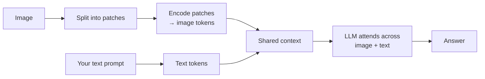

# Multimodal LLMs

> Models that accept images *and* text in the same prompt, so you can ask questions about a
> screenshot, chart, photo, or document in plain language.

## Overview

A **multimodal LLM** extends the text-only model you already know: alongside words, it can take
images as input and reason about them jointly with your text. Under the hood the image is turned
into tokens the model can attend to — the same [attention](../concepts/transformers.md) machinery,
now spanning pixels and words. That means all your text skills ([prompting](../prompting/prompt-engineering.md),
[structured outputs](../prompting/structured-outputs.md), [tool calling](../prompting/function-calling.md))
transfer directly to images.

## Learning Objectives

By the end of this page you will be able to:

- Send one or more images to a multimodal model and ask questions about them.
- Extract *structured* data from an image (not just prose).
- Estimate image token cost and control it.
- Choose when a multimodal LLM beats a specialized vision model.

## Theory

### How images become tokens

The model splits an image into patches, encodes each into a vector, and treats the result as a
sequence of "image tokens" placed in the context alongside your text tokens. Two consequences
follow immediately:

- **Images cost tokens.** A larger image = more tokens = more cost and context used. Providers
  publish a formula (roughly proportional to width × height); downscaling a huge screenshot often
  loses no useful detail while cutting cost sharply.
- **Resolution matters for fine detail.** Tiny text or dense tables may need a higher-resolution
  image (or cropping to the region of interest) to be read reliably.



### What multimodal LLMs are great at

- **Visual question answering** — "What's odd about this diagram?"
- **Document & chart understanding** — read a receipt, summarize a chart's trend.
- **Describing / captioning** — accessibility alt-text, content moderation triage.
- **UI understanding** — reason about a screenshot (the basis of "computer use" agents).

### When to use a *specialized* model instead

Multimodal LLMs are generalists. Reach for a purpose-built model when you need:

| Need | Better tool |
|------|-------------|
| High-volume, low-cost OCR | A dedicated [OCR](index.md) engine |
| Precise object locations (bounding boxes) | An object-detection model (e.g. YOLO) |
| Pixel-level masks | A segmentation model |
| Image *generation* | A diffusion model |

A common production pattern: a specialized model does the heavy perception, and the multimodal
LLM does the *reasoning* over its output.

## Practical Example

### Ask about an image

```python title="ask_image.py"
import base64
from anthropic import Anthropic

client = Anthropic()

def load_image_block(path: str, media_type: str = "image/png") -> dict:
    with open(path, "rb") as f:
        data = base64.standard_b64encode(f.read()).decode("utf-8")
    return {"type": "image", "source": {"type": "base64",
                                        "media_type": media_type, "data": data}}

resp = client.messages.create(
    model="claude-sonnet-5",
    max_tokens=400,
    messages=[{
        "role": "user",
        "content": [
            load_image_block("chart.png"),
            {"type": "text", "text": "What trend does this chart show, and what's the peak value?"},
        ],
    }],
)
print(resp.content[0].text)
```

### Extract *structured* data from an image

Combine multimodal input with [structured outputs](../prompting/structured-outputs.md) to turn a
receipt or invoice into JSON your code can use:

```python title="extract_receipt.py"
from pydantic import BaseModel

class Receipt(BaseModel):
    merchant: str
    date: str
    total: float
    currency: str

resp = client.messages.create(
    model="claude-sonnet-5",
    max_tokens=500,
    tools=[{
        "name": "record_receipt",
        "description": "Record the extracted receipt fields.",
        "input_schema": Receipt.model_json_schema(),
    }],
    tool_choice={"type": "tool", "name": "record_receipt"},
    messages=[{
        "role": "user",
        "content": [
            load_image_block("receipt.jpg", "image/jpeg"),
            {"type": "text", "text": "Extract the receipt fields."},
        ],
    }],
)
tool_use = next(b for b in resp.content if b.type == "tool_use")
print(Receipt.model_validate(tool_use.input))
```

!!! tip "Downscale before you send"
    Resize oversized images to the provider's recommended maximum before encoding. You usually
    keep all the useful detail while paying for far fewer tokens.

## Best Practices

- ✅ Downscale/crop images to what the task needs — it directly cuts cost.
- ✅ Be explicit about *what* to extract and in *what format* (use schemas).
- ✅ For dense text/tables, send higher resolution or crop to the region.
- ✅ Validate extracted fields — a confident wrong number is still wrong.
- ✅ Combine with specialized models when you need boxes, masks, or scale.

## Common Mistakes

- ❌ Sending full-resolution photos and paying for tokens you don't need.
- ❌ Expecting exact pixel coordinates — LLMs are weak at precise localization.
- ❌ Trusting extracted totals/dates without validation on critical documents.
- ❌ Using an LLM for high-volume OCR where a cheaper dedicated engine fits.

## Exercises

1. Send the same image at full size and downscaled. Compare the answer quality and the input
   token count.
2. Extract a structured `Receipt` from three different receipt photos. Where does it struggle,
   and how would you add validation?
3. Give the model a screenshot of a simple web form and ask it to list the fields and their
   types. This is the seed of a "computer use" agent.

## References

- [Anthropic — Vision](https://docs.anthropic.com/en/docs/build-with-claude/vision)
- [OpenAI — Vision guide](https://platform.openai.com/docs/guides/vision)
- Bee: [Structured Outputs](../prompting/structured-outputs.md) · [Tokenization](../concepts/tokenization.md)
