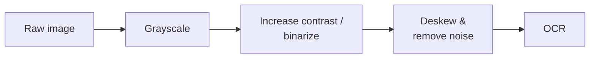
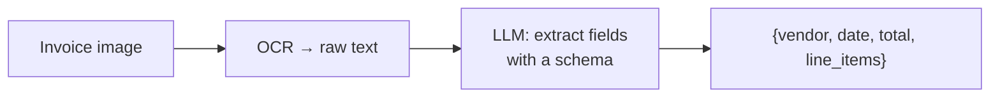

# OCR — Optical Character Recognition

> Extracting text from images and scanned documents. The workhorse behind digitizing invoices,
> receipts, forms, and books — and increasingly paired with LLMs for structure and reasoning.

## Overview

**OCR** converts pixels of text (a photo, scan, or screenshot) into machine-readable characters.
Classic engines like **Tesseract** are fast, free, and run locally; cloud OCR services add layout
and handwriting smarts; and [multimodal LLMs](multimodal-llms.md) can now read images directly.
The winning production pattern is usually a **pipeline**: OCR for accurate text extraction, then an
LLM to *structure and reason* over the result.

## Learning Objectives

By the end of this page you will be able to:

- Extract text from an image with a local OCR engine.
- Improve accuracy with simple image preprocessing.
- Decide between classic OCR, cloud OCR, and a multimodal LLM.
- Build an OCR → LLM pipeline that returns structured data.

## Theory

### The three approaches

| Approach | Strengths | Weaknesses | Use when |
|----------|-----------|------------|----------|
| **Classic OCR** (Tesseract) | Free, fast, local, high volume | Struggles with layout, handwriting, noise | Clean printed text, cost-sensitive, offline |
| **Cloud OCR** | Handles layout, tables, handwriting | Per-page cost, data leaves your machine | Complex documents at scale |
| **Multimodal LLM** | Reads *and reasons*; returns structure directly | Costlier per image; weak at exact layout | Low volume, need understanding not just text |

> [!TIP]
> For high-volume, plain printed text, classic OCR is often 10–100× cheaper than an LLM and
> plenty accurate. Reserve multimodal LLMs for when you need *understanding*, not just characters.

### Preprocessing is half the battle

OCR accuracy depends heavily on image quality. A few cheap steps dramatically improve results:



Correcting skew, boosting contrast, and denoising frequently matter more than switching engines.

### The pipeline pattern: OCR + LLM

OCR gives you *text*; an LLM turns that text into *structure and answers*:



This is more accurate and cheaper than asking an LLM to do everything, and more flexible than OCR
alone.

## Practical Example

### Extract text locally with Tesseract

```python title="ocr_basic.py"
# pip install pytesseract pillow   (also install the Tesseract binary on your OS)
import pytesseract
from PIL import Image

text = pytesseract.image_to_string(Image.open("receipt.jpg"))
print(text)
```

### Preprocess for better accuracy

```python title="ocr_preprocess.py"
from PIL import Image, ImageOps, ImageFilter
import pytesseract

def preprocess(path: str) -> Image.Image:
    img = Image.open(path)
    img = ImageOps.grayscale(img)               # drop color
    img = ImageOps.autocontrast(img)            # boost contrast
    img = img.filter(ImageFilter.MedianFilter())  # reduce speckle noise
    return img

text = pytesseract.image_to_string(preprocess("noisy_scan.png"))
print(text)
```

### OCR → LLM for structured output

```python title="ocr_to_structured.py"
import pytesseract
from PIL import Image
from anthropic import Anthropic
from pydantic import BaseModel

client = Anthropic()

class Invoice(BaseModel):
    vendor: str
    date: str
    total: float

raw_text = pytesseract.image_to_string(Image.open("invoice.png"))

resp = client.messages.create(
    model="claude-sonnet-5", max_tokens=400,
    tools=[{"name": "record_invoice", "description": "Record invoice fields.",
            "input_schema": Invoice.model_json_schema()}],
    tool_choice={"type": "tool", "name": "record_invoice"},
    messages=[{"role": "user",
               "content": f"Extract the invoice fields from this OCR text:\n\n{raw_text}"}],
)
tool_use = next(b for b in resp.content if b.type == "tool_use")
print(Invoice.model_validate(tool_use.input))
```

!!! note "Why not just send the image to the LLM?"
    You can (see [Multimodal LLMs](multimodal-llms.md)) — and for low volume it's simplest. But
    OCR + LLM is usually cheaper at scale and lets you swap a specialized OCR engine for hard
    documents while keeping the same structuring step.

## Best Practices

- ✅ Preprocess: grayscale, contrast, deskew, denoise — before blaming the engine.
- ✅ Use classic OCR for high-volume printed text; escalate to cloud/LLM for hard cases.
- ✅ Pair OCR with an LLM + schema to get validated, structured output.
- ✅ Validate critical fields (totals, dates, IDs) — OCR makes character errors.
- ✅ Keep the original image reference so a human can verify low-confidence extractions.

## Common Mistakes

- ❌ Feeding raw, skewed, low-contrast images and expecting clean text.
- ❌ Using an LLM for bulk OCR where Tesseract is far cheaper.
- ❌ Trusting OCR output for money/IDs without validation.
- ❌ Asking an LLM to both OCR *and* structure a hard scan when a dedicated OCR step would be more
  accurate.

## Exercises

1. OCR the same document raw vs. preprocessed (grayscale + contrast + denoise). Compare accuracy.
2. Build the OCR → LLM pipeline to extract `{vendor, date, total}` from three different receipts.
   Add validation for the total.
3. Compare classic OCR vs. sending the image straight to a [multimodal LLM](multimodal-llms.md) on
   a messy scan. Which wins on accuracy, cost, and effort?

## References

- [Tesseract OCR](https://github.com/tesseract-ocr/tesseract) · [pytesseract](https://github.com/madmaze/pytesseract)
- Bee: [Multimodal LLMs](multimodal-llms.md) · [Structured Outputs](../prompting/structured-outputs.md)
