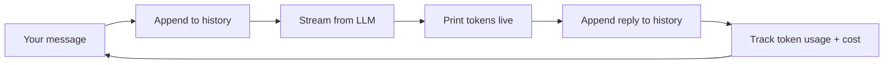

# 01 · Streaming Chatbot 🟢

> A command-line chatbot with streaming responses, conversation memory, and live cost tracking —
> the "hello world" of AI engineering, done properly.

**Level:** 🟢 Beginner
**Concepts:** [Your First LLM Call](../../docs/getting-started/first-llm-call.md) ·
[System Prompts](../../docs/prompting/system-prompts.md) ·
[Tokenization & cost](../../docs/concepts/tokenization.md) ·
[Memory](../../docs/agents/memory.md)

## What it does

A terminal chat loop where you talk to an LLM. It:

- **Streams** the reply token-by-token (feels responsive).
- **Remembers** the conversation (multi-turn context).
- **Tracks cost** — prints running token usage and an estimated price.

## What you'll learn

- The multi-turn message format (`system`, `user`, `assistant`).
- How to stream responses for a good UX.
- How conversation memory actually works (you resend history each turn).
- How to track tokens and estimate cost from day one.

## Run it

```bash
cp .env.example .env          # add your ANTHROPIC_API_KEY
uv sync                       # or: pip install -e .
python -m app
```

Then chat. Type `exit` to quit, or `reset` to clear the conversation.

```text
🐝 Bee Chatbot — type 'exit' to quit, 'reset' to clear history.
you › Explain embeddings in one sentence.
bot › Embeddings turn text into vectors of numbers so that similar meanings sit close together…
      [turn: 18 in + 24 out tokens · session: 42 tokens · ~$0.0007]
```

## How it works



The key insight for beginners: **the model is stateless.** "Memory" is just resending the whole
conversation each turn — which is why long chats cost more and eventually need
[memory management](../../docs/agents/memory.md).

The LLM client is injected into `Chatbot`, so tests can pass a fake client — no API key or network
needed in CI.

## Test

```bash
uv run pytest                 # mocks the LLM; no key/network required
```

## Going further

- Add a `system` prompt to give the bot a persona (see [System Prompts](../../docs/prompting/system-prompts.md)).
- Cap history length and summarize old turns (see [Memory](../../docs/agents/memory.md)).
- Swap in a different provider — the message shape is the same.

## References

- [Anthropic Messages API](https://docs.anthropic.com/en/api/messages)
- Bee: [Your First LLM Call](../../docs/getting-started/first-llm-call.md)
