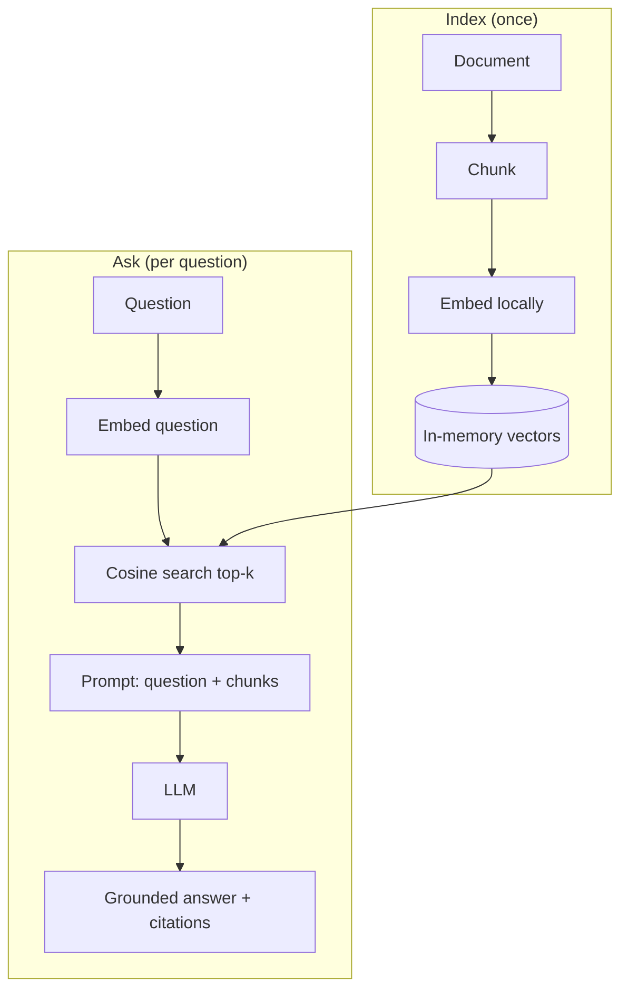

# 02 · RAG Document Q&A 🟡

> Ask questions about your own documents and get answers grounded in them — with citations. A
> complete, minimal Retrieval-Augmented Generation pipeline you can read end to end.

**Level:** 🟡 Intermediate
**Concepts:** [RAG](../../docs/rag/index.md) · [Chunking](../../docs/rag/chunking.md) ·
[Embeddings](../../docs/concepts/embeddings.md) ·
[Vector Databases](../../docs/rag/vector-databases.md)

## What it does

Point it at a text/Markdown document. It chunks the text, embeds each chunk, and stores the
vectors. When you ask a question, it retrieves the most relevant chunks and asks the LLM to answer
**using only those chunks**, citing its sources. If the answer isn't in the document, it says so.

## What you'll learn

- The full RAG loop: chunk → embed → store → retrieve → generate.
- Why grounding + citations reduce hallucination.
- How a minimal in-memory vector store works (cosine similarity).
- How to structure RAG code so each stage is testable.

## Run it

```bash
cp .env.example .env          # add your ANTHROPIC_API_KEY
uv sync                       # installs a small local embedding model too
python -m app                 # indexes data/sample.md, then asks you for questions
```

> Embeddings run **locally** via `sentence-transformers` (CPU-friendly, no extra API key).
> Generation uses the Anthropic API. First run downloads a small (~80 MB) model.

```text
Indexed 7 chunks from data/sample.md.
ask › What is the refund window?
answer › The refund window is 30 days from the date of purchase. [source: chunk-3]
```

## How it works



The `RAGPipeline` takes an **embed function** and an **LLM client** as arguments, so tests inject
fakes — no model download or API key needed in CI. See [`app/rag.py`](app/rag.py).

## Test

```bash
uv run pytest                 # fake embedder + fake LLM; no network
```

## Going further

- Swap the in-memory store for a real [vector database](../../docs/rag/vector-databases.md)
  (Chroma, pgvector).
- Add [hybrid search and reranking](../../docs/rag/hybrid-search-reranking.md).
- Add [evaluation](../../docs/rag/evaluation.md): measure recall@k and faithfulness.

## References

- Bee: [RAG section](../../docs/rag/index.md)
- [sentence-transformers](https://www.sbert.net/)
