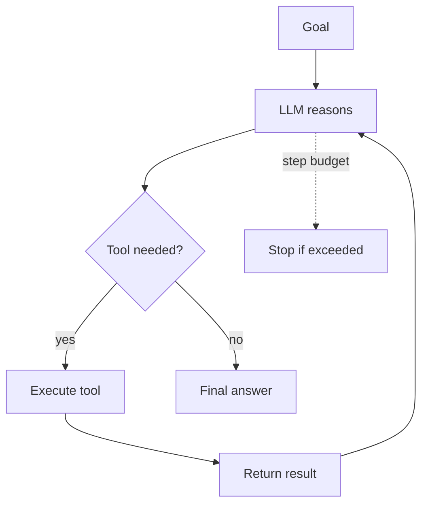

# 03 · Research Agent 🔴

> An agent that answers multi-step questions by using tools — searching and calculating — in a
> reason-act-observe loop, with a step budget so it never runs away.

**Level:** 🔴 Advanced
**Concepts:** [Agent Fundamentals](../../docs/agents/fundamentals.md) ·
[Function & Tool Calling](../../docs/prompting/function-calling.md)

## What it does

Give it a question that needs several steps ("Who is the CEO of the company that makes the Vega X,
and what year was that company founded?"). The agent:

1. **Reasons** about what to do next.
2. **Acts** by calling a tool (`search`, `calculator`).
3. **Observes** the result and loops — until it has enough to answer.

It stops when the model produces a final answer or hits the step budget.

## What you'll learn

- The core agent loop (ReAct: reason → act → observe).
- How to define tools and dispatch tool calls safely.
- Why step/cost budgets and error handling are non-negotiable.
- How this loop is the foundation of every agent framework.

## Run it

```bash
cp .env.example .env          # add your ANTHROPIC_API_KEY
uv sync                       # or: pip install -e .
python -m app                 # then type a question
```

```text
goal › What is 15% of the population of the city where the Eiffel Tower is?
  [step 1] search("city of the Eiffel Tower") → Paris (pop. ~2,100,000)
  [step 2] calculator("2100000 * 0.15") → 315000
answer › About 315,000 people (15% of Paris's ~2.1M population).
```

> The bundled `search` tool returns canned results so the example runs offline and
> deterministically. Swap in a real search API to make it live — see `app/tools.py`.

## How it works



The `Agent` takes an injected LLM client and a tool registry, so tests drive it with a scripted
fake client — verifying the loop calls tools and terminates, with no API key or network. See
[`app/agent.py`](app/agent.py).

## Test

```bash
uv run pytest                 # scripted fake client; no network
```

## Going further

- Replace canned `search` with a real web search API.
- Add a step to [reflect](../../docs/agents/fundamentals.md) before the final answer.
- Add [memory](../../docs/agents/memory.md) so the agent recalls earlier sessions.
- Expose the tools over [MCP](../../docs/agents/mcp.md) to reuse them across apps.

## References

- Bee: [Agent Fundamentals](../../docs/agents/fundamentals.md)
- [ReAct paper](https://arxiv.org/abs/2210.03629)
