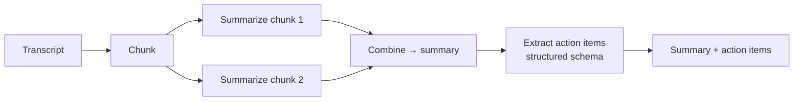

# 04 · Meeting Summarizer 🟡

> Turn a long meeting transcript into a concise summary **and** a structured list of action items
> — combining map-reduce summarization with schema-enforced extraction.

**Level:** 🟡 Intermediate
**Concepts:** [Chunking](../../docs/rag/chunking.md) ·
[Structured Outputs](../../docs/prompting/structured-outputs.md) ·
[Prompt Engineering](../../docs/prompting/prompt-engineering.md)

## What it does

Given a transcript, it:

1. **Chunks** the transcript (transcripts get long).
2. **Map:** summarizes each chunk.
3. **Reduce:** combines the partial summaries into one coherent summary.
4. **Extracts action items** as structured data (`task`, `owner`, `due`) you can drop into a
   task tracker.

## What you'll learn

- The **map-reduce** pattern for processing text longer than one comfortable prompt.
- Combining free-form generation (summary) with **structured output** (action items).
- Why splitting a job into map → reduce → extract is more reliable than one giant prompt.

## Run it

```bash
cp .env.example .env          # add your ANTHROPIC_API_KEY
uv sync                       # or: pip install -e .
python -m app                 # summarizes data/sample_transcript.txt
```

```text
=== SUMMARY ===
The team reviewed the beta launch (50 users, mostly positive) ...

=== ACTION ITEMS ===
1. Investigate the large-file upload crash — Bob (due Friday)
2. Update the getting-started guide — Carol (due Wednesday)
3. Schedule a pricing decision meeting — Bob (due Monday)
```

## How it works



The `MeetingSummarizer` takes an injected LLM client, so tests drive it with a fake that returns
canned summaries and a scripted tool call — no API key or network. See
[`app/summarizer.py`](app/summarizer.py).

## Test

```bash
uv run pytest                 # fake client; no network
```

## Going further

- Feed real transcripts from a [speech-to-text](../../docs/speech/speech-to-text.md) step to build
  a full meeting assistant.
- Add a `decisions` schema alongside action items.
- Push extracted action items to a task tracker via a [tool call](../../docs/prompting/function-calling.md).

## References

- Bee: [Chunking](../../docs/rag/chunking.md) · [Structured Outputs](../../docs/prompting/structured-outputs.md)
