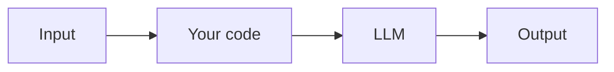

# Example Template

> One-sentence description of what this example does and what the reader will learn.

**Level:** 🟢 Beginner / 🟡 Intermediate / 🔴 Advanced
**Concepts:** link the relevant [Bee docs](../../docs/) (e.g. [Tool Calling](../../docs/prompting/function-calling.md))

Copy this folder to `examples/NN-your-example/` and replace every section below. Delete this
intro paragraph.

## What it does

A short paragraph. What problem does it solve? What will the reader see when they run it?

## What you'll learn

- Bullet 1
- Bullet 2
- Bullet 3

## Run it

```bash
cp .env.example .env          # add your API key
uv sync                       # or: pip install -e .
python -m app
```

## How it works

Explain the key ideas, ideally with a small diagram:



Walk through the important parts of the code. Link back to the concept docs.

## Test

```bash
uv run pytest                 # tests mock the LLM — no API key/network needed
```

## Going further

- Ideas for extending the example.
- Links to related examples and docs.

## References

- Relevant Bee docs and external sources.
