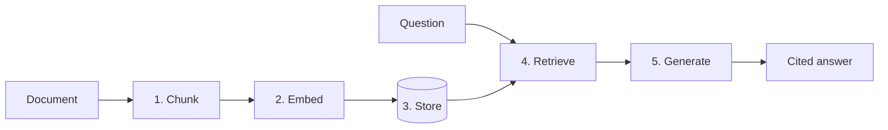

# Tutorial: Build a RAG System from Scratch

> Build a working document Q&A system step by step — chunking, embeddings, retrieval, and grounded
> generation — understanding each piece as you add it.

**Level:** 🟡 Intermediate
**Time:** ~30 minutes
**Prerequisites:** [Embeddings](../docs/concepts/embeddings.md), Python, an API key
([setup](../docs/getting-started/setup.md))
**You'll build:** the system in [`examples/02-rag-document-qa`](../examples/02-rag-document-qa/) —
refer to it if you get stuck.

## What we're building



We'll do it in five steps, testing our understanding at each one.

## Step 0 — Setup

```bash
pip install sentence-transformers anthropic python-dotenv
```

We use `sentence-transformers` for **local** embeddings (no extra API key, CPU-friendly) and
Anthropic for generation.

## Step 1 — Chunk the document

We can't embed a whole document as one vector — meaning gets diluted. We split it into pieces.
(Why? See [Chunking](../docs/rag/chunking.md).)

```python
def chunk_text(text: str, max_chars: int = 600) -> list[str]:
    paragraphs = [p.strip() for p in text.split("\n\n") if p.strip()]
    chunks, current = [], ""
    for para in paragraphs:
        if len(current) + len(para) <= max_chars:
            current = f"{current}\n\n{para}".strip()
        else:
            chunks.append(current)
            current = para
    if current:
        chunks.append(current)
    return chunks
```

✅ **Checkpoint:** `chunk_text(doc)` returns a list of readable, self-contained pieces.

## Step 2 — Embed the chunks

Turn each chunk into a vector so we can compare meanings. (Why? See
[Embeddings](../docs/concepts/embeddings.md).)

```python
from sentence_transformers import SentenceTransformer

model = SentenceTransformer("all-MiniLM-L6-v2")

def embed(texts: list[str]) -> list[list[float]]:
    return model.encode(texts, normalize_embeddings=True).tolist()
```

✅ **Checkpoint:** `embed(["hello"])` returns a list with one vector of floats.

## Step 3 — Store the vectors

For learning, a plain list + cosine similarity is enough (real apps use a
[vector database](../docs/rag/vector-databases.md)).

```python
import math

def cosine(a, b):
    dot = sum(x * y for x, y in zip(a, b))
    na = math.sqrt(sum(x * x for x in a)); nb = math.sqrt(sum(y * y for y in b))
    return dot / (na * nb) if na and nb else 0.0

# store = list of (chunk_text, vector)
chunks = chunk_text(document)
store = list(zip(chunks, embed(chunks)))
```

## Step 4 — Retrieve relevant chunks

Embed the question, find the closest chunks.

```python
def retrieve(question: str, k: int = 3):
    q = embed([question])[0]
    scored = sorted(store, key=lambda pair: cosine(q, pair[1]), reverse=True)
    return [text for text, _ in scored[:k]]
```

✅ **Checkpoint:** `retrieve("your question")` returns the most relevant chunks — even if they
share no keywords with the question. That's semantic search working.

## Step 5 — Generate a grounded answer

Give the model the question *and* the retrieved chunks, and instruct it to answer only from them.

```python
from anthropic import Anthropic
client = Anthropic()

def answer(question: str) -> str:
    context = "\n\n".join(retrieve(question))
    resp = client.messages.create(
        model="claude-sonnet-5", max_tokens=400,
        system="Answer using ONLY the context. If it's not there, say you don't know.",
        messages=[{"role": "user", "content": f"Context:\n{context}\n\nQuestion: {question}"}],
    )
    return resp.content[0].text

print(answer("What is the refund window?"))
```

🎉 **You built RAG.** The model now answers from *your* document, grounded in retrieved facts.

## Where to go next

- Compare with the finished [`examples/02-rag-document-qa`](../examples/02-rag-document-qa/)
  (adds citations, metadata, tests).
- Improve retrieval with [hybrid search & reranking](../docs/rag/hybrid-search-reranking.md).
- Measure quality with [RAG evaluation](../docs/rag/evaluation.md).
- Swap the list for a real [vector database](../docs/rag/vector-databases.md).
